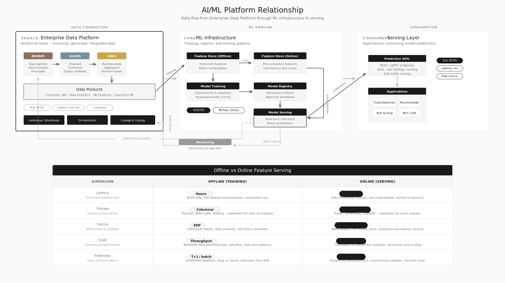
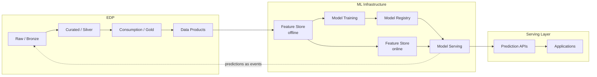

# How the Enterprise Data Platform Feeds AI and ML

## Executive Summary

- The EDP is the foundation for enterprise AI/ML: curated training data, feature engineering, historical validation datasets
- AI/ML has distinct platform needs that the EDP alone cannot serve -- feature stores, model registries, serving infrastructure, and vector stores each have specific requirements
- The data flow is bidirectional: EDP feeds models, model outputs generate new data that flows back to the EDP
- "Just query the lakehouse from the model" breaks at production scale
- Getting this relationship right is the difference between AI experiments and AI in production

<!--  -->

## The EDP as AI Foundation

The EDP provides three things that AI/ML cannot work without:

**Curated training datasets.** ML models are only as good as their training data. The EDP's bronze/silver/gold layers produce clean, integrated, historized datasets that are ready for training. Without the EDP, data scientists spend 80% of their time cleaning and joining data from source systems.

**Feature engineering at scale.** Complex features require joining data across domains (customer transactions + product catalog + behavioral events). The EDP is the only place where this cross-domain data exists in governed, integrated form.

**Historical data for model validation.** Models need backtesting against historical data. The EDP's append-mostly, historized design preserves the time-series data that backtesting requires. Operational systems that overwrite current state cannot provide this.

## Where the EDP Stops and ML Infrastructure Begins

### Feature Store Pattern

The feature store bridges analytical and operational worlds:

| Aspect | Offline Feature Store | Online Feature Store |
|--------|----------------------|---------------------|
| **Source** | EDP data products | Precomputed from offline or real-time events |
| **Latency** | Minutes to hours | Milliseconds |
| **Use case** | Model training, batch scoring | Real-time inference |
| **Storage** | Columnar (BigQuery, Delta) | Key-value (Redis, DynamoDB, Bigtable) |
| **Update frequency** | Batch (hourly, daily) | Near real-time or on-demand |

The EDP feeds the offline feature store. The offline store materializes features to the online store for production serving. This separation is why "just query the lakehouse" breaks: production models need millisecond feature lookups, not second-scale analytical queries.

### Vector Stores and Embeddings

With the rise of RAG and semantic search, vector stores are now part of the AI infrastructure:

- **Where embeddings are generated:** ML pipelines running against EDP data products
- **Where embeddings are stored:** Purpose-built vector databases (Pinecone, Weaviate, pgvector, Vertex AI Vector Search)
- **Where embeddings are served:** Alongside or behind the model serving layer
- **What the EDP provides:** The source documents, structured data, and metadata that embeddings are generated from
- **What the EDP does not do:** Store or serve embeddings at query-time latency

### Model Training vs Model Serving

| Concern | Model Training | Model Serving |
|---------|---------------|---------------|
| **Data source** | EDP data products, offline feature store | Online feature store, real-time events |
| **Compute** | GPU clusters, batch processing | Low-latency inference endpoints |
| **Latency tolerance** | Hours | Milliseconds |
| **Scale pattern** | Throughput (process all training data) | Concurrency (handle prediction requests) |
| **Where it runs** | ML platform (Vertex AI, SageMaker, Databricks ML) | Serving infrastructure (endpoints, containers) |

### The Feedback Loop

Model outputs generate new data:

1. **Predictions become events.** A fraud model scores a transaction. That score is an event that flows back through the event backbone into the EDP.
2. **Model monitoring data flows to EDP.** Prediction distributions, feature drift, model performance metrics are analytical data that belongs in the EDP.
3. **Retraining uses updated EDP data.** As new operational data flows into the EDP, models retrain on fresher, more complete datasets.
4. **A/B test results land in EDP.** Experiment outcomes are analytical data for model selection decisions.

This feedback loop is what makes AI production-grade. Without it, models train on stale data and drift silently.

## Why "Just Query the Lakehouse" Breaks

| What They Try | Why It Fails |
|--------------|-------------|
| Model training job queries BigQuery/Databricks directly | Works initially, breaks at scale: query costs explode, compute contention with analytics users, no feature reuse |
| Serving endpoint queries lakehouse for features at inference time | Latency is 100x too slow (seconds vs milliseconds). Concurrent queries overwhelm the analytical engine. |
| Embeddings stored in lakehouse tables | Vector similarity search on columnar storage is orders of magnitude slower than purpose-built vector indexes |
| Model outputs written directly to gold layer | Skips data quality checks, lineage tracking, and schema validation that the EDP pipeline provides |

The fix is always the same: purpose-built infrastructure for each concern, connected by well-defined data flows with the EDP at the center.
