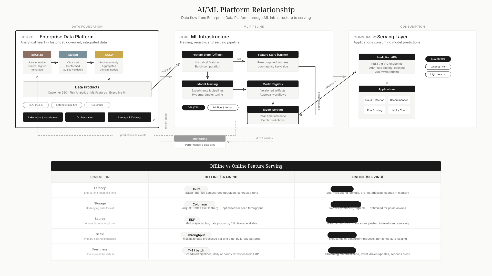
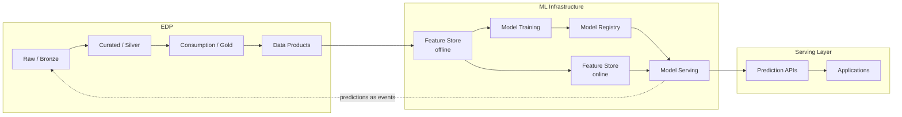

# How the Enterprise Data Platform Feeds AI and ML

The EDP is the supply side of enterprise AI. Two generations of consumers now draw on it: classic model pipelines (feature engineering, training, batch scoring) and language-model systems (RAG, fine-tuning, agents). Both depend on the same governed, historized, integrated data. Neither gets to run inside the EDP. Getting this relationship right is the difference between AI experiments and AI in production.

<figure class="hero-figure">
  
  <figcaption>Data flow from EDP through ML infrastructure to serving, with feedback loop</figcaption>
</figure>

## The EDP as AI Foundation

The EDP provides three things that AI cannot work without.

**Curated training datasets.** Models are only as good as their data. The EDP's refinement layers produce clean, integrated, historized datasets that are ready for training. Without them, data scientists spend most of their time cleaning and joining data from source systems instead of building models.

**Feature engineering at scale.** Complex features require joining data across domains (customer transactions + product catalog + behavioral events). The EDP is the only place where this cross-domain data exists in governed, integrated form.

**Historical data for validation.** Models need backtesting against history. The EDP's append-mostly, historized design preserves the time series that backtesting requires. Operational systems that overwrite current state cannot provide this.

## Where the EDP Stops and ML Infrastructure Begins

```mermaid
graph LR
    subgraph EDP
        A[Raw / Bronze] --> B[Curated / Silver]
        B --> C[Consumption / Gold]
        C --> D[Data Products]
    end

    subgraph "ML Infrastructure"
        D --> E[Feature Store<br/>offline]
        E --> F[Model Training]
        F --> G[Model Registry]
        G --> H[Model Serving]
        E --> I[Feature Store<br/>online]
        I --> H
    end

    subgraph "Serving Layer"
        H --> J[Prediction APIs]
        J --> K[Applications]
    end

    H -.-> |"predictions as events"| A
```

### Feature Store Pattern

The feature store bridges the analytical and operational worlds:

| Aspect | Offline Feature Store | Online Feature Store |
|--------|----------------------|---------------------|
| **Source** | EDP data products | Precomputed from offline or real-time events |
| **Latency** | Minutes to hours | Milliseconds |
| **Use case** | Model training, batch scoring | Real-time inference |
| **Storage** | Columnar (BigQuery, Delta) | Key-value (Redis, DynamoDB, Bigtable) |
| **Update frequency** | Batch (hourly, daily) | Near real-time or on-demand |

The EDP feeds the offline feature store. The offline store materializes features to the online store for production serving. This separation is why "just query the lakehouse" breaks: production models need millisecond feature lookups, not second-scale analytical queries.

### Model Training vs Model Serving

| Concern | Model Training | Model Serving |
|---------|---------------|---------------|
| **Data source** | EDP data products, offline feature store | Online feature store, real-time events |
| **Compute** | GPU clusters, batch processing | Low-latency inference endpoints |
| **Latency tolerance** | Hours | Milliseconds |
| **Scale pattern** | Throughput (process all training data) | Concurrency (handle prediction requests) |
| **Where it runs** | ML platform (Vertex AI, SageMaker, Databricks ML) | Serving infrastructure (endpoints, containers) |

## The LLM Data Supply Chain

Language-model systems changed what the EDP is asked to supply, without changing the rules about what runs where. Five workloads now belong in the platform's scope.

**Unstructured ingestion as first-class ELT.** Contracts, policy documents, call transcripts, emails, and knowledge-base articles are now source data, not exhaust. They need the same treatment structured data gets: registered sources, ingestion pipelines, quality checks (parse success, duplication, staleness), and sensitivity classification before anything downstream touches them. Chunking and parsing logic is transformation code; version it and test it like any other pipeline.

**Embedding pipelines as scheduled workloads.** Embedding generation is a transformation with lineage: this chunk, from this document version, through this embedding model version, produced this vector. When the source document changes or the embedding model is upgraded, affected vectors must be identifiable and refreshable. An embedding pipeline without lineage produces a retrieval corpus nobody can audit or rebuild.

**RAG corpora as data products.** A retrieval corpus is a data product like any other: it has an owner, a quality contract (coverage, freshness, provenance), access controls inherited from its source documents, and versioning. The most common RAG failure in enterprises is not the model; it is a corpus assembled once from an unaudited document dump, with no owner and no refresh path. Access control matters doubly here, because a document a user cannot open must not become retrievable through an assistant that read it during indexing.

**Fine-tuning and evaluation datasets as governed artifacts.** Instruction datasets, preference pairs, and evaluation sets determine model behavior, and regulators increasingly treat them as evidence (see the [EU AI Act mapping](../compliance/eu-ai-act.md)). They belong in the EDP with the same versioning, lineage, and documentation as any regulatory data product: where each example came from, what filtering was applied, and which model versions consumed which dataset versions.

**Feedback and trace data as a new source system.** LLM applications emit prompts, responses, retrieval hits, tool calls, and user feedback. This trace data is the raw material for evaluation, cost analysis, and the next round of fine-tuning. Treat the AI application as a source system: its traces flow through the event backbone into bronze like any other operational events, with PII handling applied at ingestion.

## What Stays Out

The placement rules do not soften because the workload says "AI":

- **Vector serving** runs on purpose-built stores (pgvector, Vertex AI Vector Search, Pinecone, or the warehouse vendors' serving-grade offerings), fed by the EDP. Similarity search at query-time latency is a serving workload.
- **Model inference** runs on ML serving infrastructure. The EDP supplies features and context; it does not host the request path.
- **Agent runtimes** are operational systems. They read governed data products and write events back; they do not execute inside the platform. How agents consume the EDP safely is its own topic: [Agents as Consumers](agent-access.md).

## The Feedback Loop

Model outputs generate new data:

1. **Predictions and traces become events.** A fraud model scores a transaction; an assistant answers a question. Scores, responses, and retrieval traces flow back through the event backbone into the EDP.
2. **Monitoring data flows to the EDP.** Prediction distributions, feature drift, evaluation scores, and token costs are analytical data that belongs in the platform.
3. **Retraining and re-indexing use updated EDP data.** As new operational data arrives, models retrain and corpora refresh from governed, current datasets.
4. **Experiment results land in the EDP.** A/B outcomes and evaluation runs are analytical data for model selection decisions.

This feedback loop is what makes AI production-grade. Without it, models train on stale data and drift silently.

## Why "Just Query the Lakehouse" Breaks

| What They Try | Why It Fails |
|--------------|-------------|
| Model training job queries BigQuery/Databricks directly | Works initially, breaks at scale: query costs explode, compute contention with analytics users, no feature reuse |
| Serving endpoint queries lakehouse for features at inference time | Latency is orders of magnitude too slow (seconds vs milliseconds). Concurrent queries overwhelm the analytical engine. |
| Embeddings stored in lakehouse tables | Vector similarity search on columnar storage is far slower than purpose-built vector indexes |
| RAG corpus built from a one-time document export | No refresh path, no lineage, no access control inheritance; the corpus is stale the day it ships |
| Model outputs written directly to gold layer | Skips the quality checks, lineage tracking, and schema validation that the EDP pipeline provides |

The fix is always the same: purpose-built infrastructure for each concern, connected by well-defined data flows, with the EDP at the center of supply.
