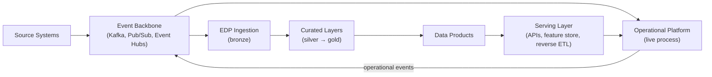
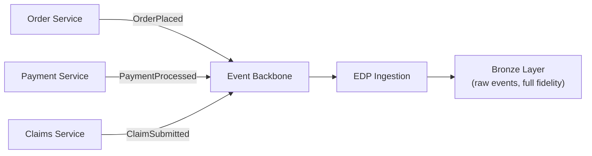
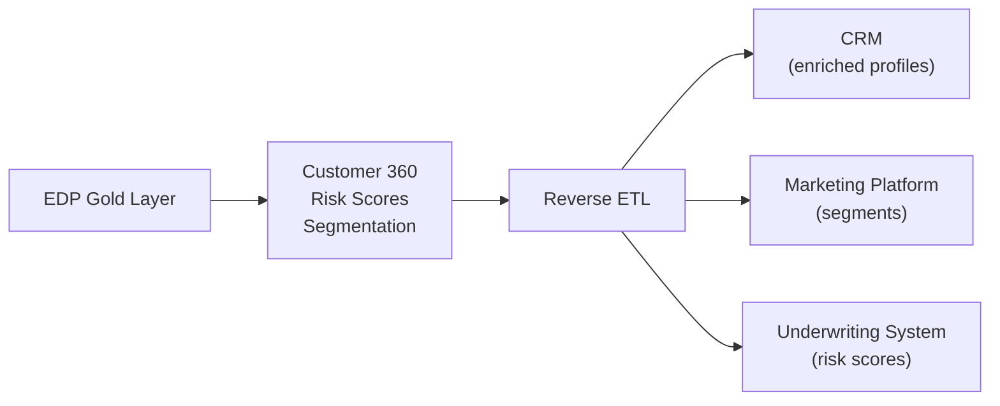
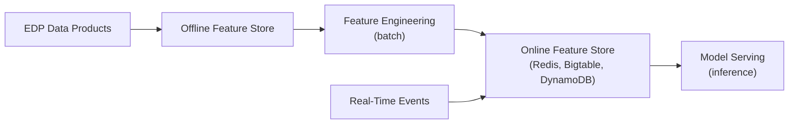
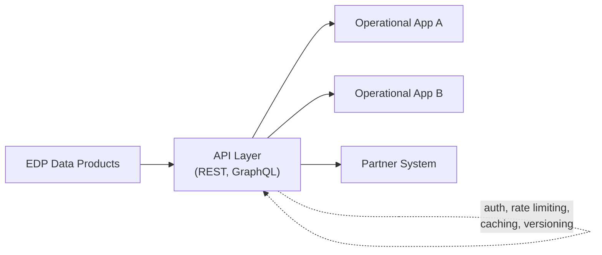
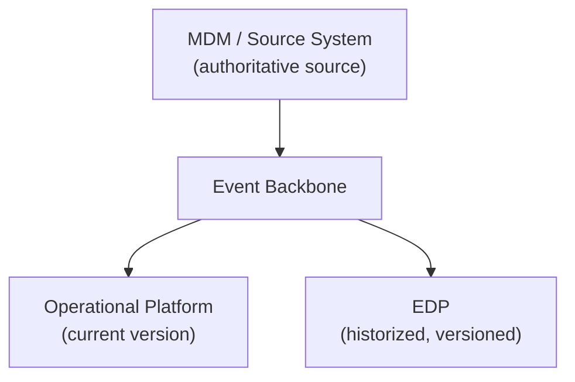

# How EDP and Operational Platforms Coexist

## Executive Summary

- The value is not "EDP good, operational bad" or vice versa. Both platforms exist because they solve fundamentally different problems with fundamentally different architectures.
- Both platforms serve distinct purposes and connect through well-defined integration patterns. Trying to collapse them into one system creates a platform that is mediocre at everything and excellent at nothing.
- The closed loop -- source systems generate events, the operational platform handles live process, the EDP ingests for history and analytics, curated data products feed back to operations through serving layers -- is the core of enterprise data architecture.
- Getting this integration right is what separates enterprises that have data platforms from enterprises that get value from them.
- This page shows the five patterns that make coexistence work, and the anti-patterns that break it.

## The Closed Loop

The EDP and operational platform form a continuous cycle. Data flows from source systems through the event backbone, gets processed independently by both platforms, and feeds back in both directions.

Every arrow in this diagram represents a contract. The event backbone defines event schemas. The EDP defines data product schemas. The serving layer defines API contracts. When teams treat these as informal, ad-hoc connections, the loop breaks. When they formalize them, the loop compounds value over time.

## Pattern 1: Event-Driven Ingestion

Operational systems emit domain events as part of their normal operation: order placed, payment processed, claim submitted, account opened. These events flow through the backbone. The EDP subscribes to the events it needs.

**Key principle:** Operational systems are unaware of the EDP. They emit events because events are part of their domain model. The EDP subscribes. This means operational systems never need to change when the EDP adds new consumers, new transformations, or new data products.

This is the most important pattern. If you get nothing else right, get this one right.

| Concern | Guidance |
|---------|----------|
| **Event schema** | Owned by the producing service. Published to a schema registry. |
| **Delivery guarantee** | At-least-once. The EDP handles idempotency. |
| **Retention** | The backbone retains events long enough for the EDP to consume. The EDP provides long-term historization. |
| **Ordering** | Per-entity ordering (partition key) is usually sufficient. Global ordering is rarely needed and expensive. |

## Pattern 2: Reverse ETL / Operational Sync

The EDP computes things that operational systems cannot compute on their own: Customer 360 profiles, risk scores, segmentation labels, propensity models, lifetime value calculations. These computations require joining data across domains, applying complex business logic, and processing historical data -- none of which operational systems are designed for.

Selected datasets are pushed back to operational systems via reverse ETL.

**Key principle:** The EDP is the source of truth for the computed data. The operational system receives a copy. If the CRM shows a customer's risk score, that score was computed by the EDP and pushed to the CRM. The CRM does not compute it.

| Concern | Guidance |
|---------|----------|
| **Freshness** | Batch is fine for most use cases (hourly, daily). Near real-time reverse ETL adds complexity -- justify it with a real business requirement. |
| **Conflict resolution** | The EDP-computed field overwrites the operational field. There is no merge. If there is ambiguity about which system owns a field, you have a governance problem, not a technical one. |
| **Scope** | Push only what the operational system needs. Do not replicate the entire gold layer into every downstream system. |

## Pattern 3: Feature Serving

ML models in production need features at inference time. The EDP computes these features offline (batch feature engineering), but serving them at inference-time latency requires a different infrastructure.

**Key principle:** EDP computes, the serving layer delivers. The EDP is never queried at inference time. A model that needs a customer's 90-day transaction summary does not query BigQuery in the request path. That summary was precomputed by the EDP, materialized to an online store, and is fetched in milliseconds when the model needs it.

| Aspect | Offline (EDP) | Online (Serving) |
|--------|--------------|-----------------|
| **Latency** | Minutes to hours | Milliseconds |
| **Compute** | Batch processing, SQL, Spark | Key-value lookup |
| **Update frequency** | Scheduled (hourly, daily) | Precomputed or streaming |
| **Consumer** | Model training, batch scoring | Real-time inference endpoints |

## Pattern 4: API-Mediated Access

Data products are not tables you give people credentials to. In cross-platform scenarios, data products are exposed through APIs.

**Key principle:** The API layer decouples consumers from the EDP's internal structure. When the EDP migrates from one storage engine to another, refactors its medallion layers, or restructures its data products, the API contract stays stable. Consumers call APIs, not query the lakehouse.

| Concern | Guidance |
|---------|----------|
| **Authentication** | OAuth2 / service accounts. Never shared credentials. |
| **Rate limiting** | Protect the EDP from noisy consumers. Different tiers for different use cases. |
| **Caching** | Cache aggressively for data that changes infrequently (reference data, daily aggregates). |
| **Versioning** | API versioning is non-negotiable. Breaking changes get a new version, not a silent update. |

## Pattern 5: Shared Reference Data

Master data -- customer, product, location, organizational hierarchy -- is consumed by both platforms. The source of truth is typically an MDM system or a designated source system. Both the EDP and the operational platform consume from that same source.

**Key principle:** One authoritative source, two consumption patterns. The operational platform uses the current version of a customer record for live transactions. The EDP historizes every version for analytics, regulatory reporting, and audit. Neither platform tries to be the master. The master is the master.

| Concern | Operational Platform | EDP |
|---------|---------------------|-----|
| **What it stores** | Current state only | Full history (SCD Type 2 or append-only) |
| **Why** | Transactions need the latest record | Analytics and compliance need point-in-time accuracy |
| **Update pattern** | Overwrite on change | Append new version, close previous |
| **Latency** | Immediate propagation | Minutes to hours is acceptable |

## Integration Anti-Patterns

These are the patterns that look like shortcuts and end up as long-term liabilities.

**Direct database connections between platforms.** When the operational platform queries the EDP's database directly -- or vice versa -- you have created a coupling that makes independent evolution impossible. Schema changes in one platform break the other. Maintenance windows collide. Performance degrades unpredictably.

**Operational systems querying the EDP for live decisions.** The EDP is optimized for analytical throughput, not transactional latency. When an operational system queries the EDP in a user-facing request path, you get inconsistent response times, query queuing during peak analytical workloads, and an architecture that is fragile under load. Use a serving layer (Pattern 3, Pattern 4).

**Batch file transfers as the primary integration mechanism.** CSV files on SFTP servers, shared NFS mounts, nightly database dumps. These are not integration patterns -- they are the absence of an integration pattern. No schema contracts, no delivery guarantees, no observability, no error handling beyond "the file didn't show up."

**Shared databases between operational and analytical workloads.** The single worst architectural decision in enterprise data. Operational workloads need transactional consistency, low latency, and high concurrency. Analytical workloads need full scans, complex joins, and high throughput. Running both against the same database means neither gets what it needs. This is the problem the EDP exists to solve.
