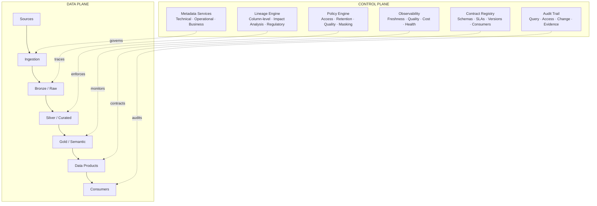

# EDP Control Plane

## Executive Summary

- The control plane is the governance and observability infrastructure that governs the entire data platform. It is not the data movement layer.
- It ensures that every data movement, transformation, and access decision is governed, observable, and auditable.
- Control plane capabilities span metadata, lineage, policy, contracts, audit, and observability -- six distinct service groups with different owners and operational characteristics.
- Without a control plane, you have a data lake. With one, you have a governed platform.
- Every regulatory conversation, cost allocation question, and incident investigation starts and ends in the control plane.

## What the Control Plane Contains

Six service groups. Each has a single responsibility, a distinct set of consumers, and a measurable outcome.

### Metadata Services

The platform's memory. Without metadata services, every question about the data platform requires someone to look at code.

| Category | What It Captures |
|---|---|
| Technical metadata | Schemas, column types, partitioning strategies, storage formats, table statistics |
| Operational metadata | Pipeline run history, job durations, data volumes processed, last successful refresh timestamps |
| Business metadata | Human-readable descriptions, ownership assignments, domain classification, sensitivity and confidentiality tags |

**Key principle:** Metadata is not documentation. It is machine-readable state that drives automation. If your metadata is only in a wiki, it is not metadata -- it is prose.

### Lineage Engine

The platform's nervous system. Lineage answers three questions that every regulated enterprise must answer: where did this data come from, what happened to it, and who consumed it.

| Capability | Description |
|---|---|
| Column-level lineage | Automated tracing from source column to every downstream transformation, aggregation, and consumption point |
| Impact analysis | Given a source change, identify every downstream dataset, report, model, and consumer affected |
| Regulatory lineage | Trace any reported metric, regulatory filing, or executive dashboard number back to its source records |

**Key principle:** Lineage that stops at the table level is insufficient. Column-level lineage is the minimum for regulatory traceability. If your lineage engine cannot answer "which source rows contributed to this number," it is not production-grade.

### Policy Engine

The platform's rule book. Policies are not guidelines. They are executable rules that the platform enforces automatically.

| Policy Type | What It Governs |
|---|---|
| Access policies | Who can access what data, at what granularity (row, column, cell), under what conditions |
| Retention policies | How long data is retained at each storage tier, when it moves to cold storage, when it is permanently deleted |
| Quality policies | What quality thresholds apply to each data product -- completeness, accuracy, timeliness, uniqueness |
| Masking policies | Which columns are dynamically masked for which roles -- PII, financial, health data |

**Key principle:** If a policy exists only in a document, it will be violated. Policies must be code, evaluated at query time or ingestion time, with violations logged and alerted on.

### Contract Registry

The platform's agreement system. Data contracts formalize the interface between producers and consumers. Without them, every schema change is a surprise.

| Capability | Description |
|---|---|
| Contract store | Central registry of all active data contracts -- schema definition, SLA commitments, quality guarantees, ownership |
| Version history | Complete audit trail of every contract change -- what changed, who changed it, when, and why |
| Consumer registration | Registry of every consumer of every data product -- who depends on what, through which interface |
| Breaking change detection | Automated identification of schema or SLA changes that would violate existing consumer contracts, with notification before deployment |

**Key principle:** A data product without a contract is an unmanaged dependency. Consumer registration is not optional -- you cannot assess impact if you do not know who consumes what.

### Audit Trail

The platform's legal record. Every action on the platform is recorded. This is not optional for regulated industries -- it is a compliance requirement.

| Audit Type | What It Records |
|---|---|
| Query audit | Who ran what query, when, against which dataset, how many rows returned |
| Access audit | Who was granted or revoked access, by whom, through what approval process |
| Change audit | What pipeline, schema, policy, or configuration changes were made, by whom, with what justification |
| Evidence export | Regulatory-ready audit reports -- pre-formatted for SOX, GDPR, APRA, BCBS 239, and internal audit consumption |

**Key principle:** Audit logs must be immutable and retained independently of the data they describe. If an administrator can delete audit records, you do not have an audit trail.

### Observability Layer

The platform's dashboard. Observability answers: is the platform healthy, is it meeting its commitments, and what is it costing.

| Dashboard | What It Shows |
|---|---|
| Data freshness | Is each data product within its SLA? Time since last successful refresh vs committed SLA |
| Quality health | Are quality thresholds met? Trend of quality scores over time, breach alerts |
| Cost allocation | What is each workload, domain, and data product costing? Compute, storage, egress, broken down by owner |
| Platform health | Infrastructure utilization, job queue depth, error rates, query concurrency, storage growth |

**Key principle:** Observability without SLOs is monitoring. Observability with SLOs is accountability. Every dashboard must reference a target, not just show a number.

## Control Plane vs Data Plane

The data plane moves, transforms, and stores data. The control plane ensures that movement is governed. They are distinct infrastructure with distinct ownership.

| Concern | Data Plane | Control Plane |
|---|---|---|
| Purpose | Move, transform, store data | Govern, observe, audit data |
| What changes | Data values and schemas | Policies, contracts, access rules |
| Latency requirement | Throughput-optimized | Near-real-time for alerts, batch for reports |
| Failure impact | Data is stale or missing | Governance is blind, compliance is at risk |
| Owned by | Platform engineering | Governance and platform engineering jointly |
| Change frequency | Every pipeline run | Policy reviews, contract negotiations, access requests |
| Testing approach | Data quality assertions | Policy simulation, contract compatibility checks |

**Key principle:** Control plane failures are silent. A failed pipeline is visible immediately. A broken lineage tracker or a misconfigured access policy may not surface for weeks -- until an auditor asks a question you cannot answer.

## Why the Control Plane Matters

### Compliance

Regulators do not ask "what database do you use." They ask: can you trace this reported number to its source? Can you prove who accessed customer data last quarter? Can you demonstrate that deleted data is actually deleted? Every one of these questions is answered by the control plane, not the data plane.

### Operations

Incident response without lineage is guesswork. Cost optimization without allocation is politics. Capacity planning without utilization data is budgeting in the dark. The control plane converts a reactive platform team into a proactive one.

### Trust

Data consumers -- analysts, data scientists, business users -- trust data they can verify. When a consumer can see lineage, check freshness, read the contract, and verify quality scores, adoption accelerates. When they cannot, they build their own extracts and shadow pipelines. The control plane is what makes a platform a platform, rather than a collection of pipelines.
