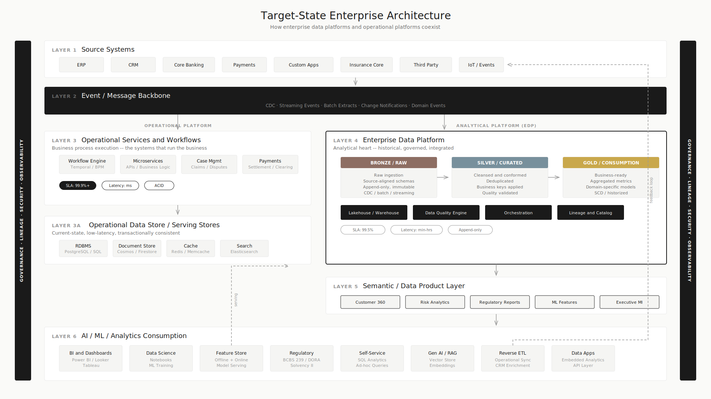
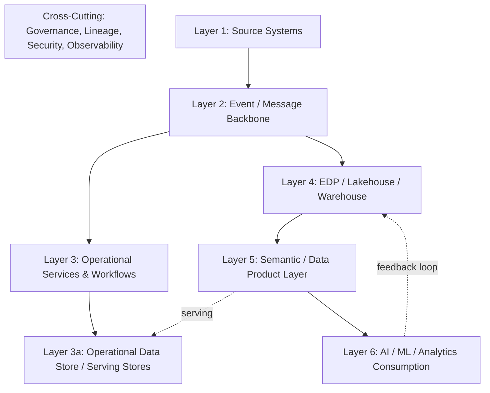

# Target-State Enterprise Architecture

## Executive Summary

- A reference architecture showing how enterprise data platforms and operational platforms coexist across seven layers
- Each layer has a distinct responsibility, distinct technology choices, and distinct operational characteristics
- Governance, lineage, security, and observability cut across all layers as shared concerns
- This is not a vendor recommendation. It is an architectural pattern that maps to any major cloud provider.
- Cloud-specific variants (GCP, Azure) show how the conceptual layers map to real services.

<!--  -->

## The Seven Layers

### Layer 1: Source Systems

The origin of all data. ERP, CRM, core banking, payments, custom applications. These systems own their operational data and emit changes via events, CDC, or batch extracts.

**Key principle:** Source systems are producers. They should not be aware of downstream consumers. Data flows out via events or CDC, not via direct queries from downstream platforms.

### Layer 2: Event / Message Backbone

The connective tissue. Kafka, Pub/Sub, Event Hubs, or equivalent. Every operational event and data change flows through this layer.

**Key principle:** The event backbone decouples producers from consumers. Operational services and the EDP both consume from the same backbone independently.

### Layer 3: Operational Services and Workflows

Business process execution. Workflow engines, microservices, case management, payments processing. These are the systems that "run the business."

**Key principle:** Operational services own current state. They process transactions, manage workflows, and serve live business operations. They do not query the EDP for operational decisions.

### Layer 3a: Operational Data Store / Serving Stores

Purpose-built stores for operational access patterns. Low-latency lookups, transactional consistency, high concurrency.

**Key principle:** The ODS is not the EDP. It holds current-state, denormalized, access-optimized data for operational use. It may be fed by the EDP or by source systems directly, depending on the use case.

### Layer 4: EDP / Lakehouse / Warehouse

The analytical heart. Raw ingestion (bronze), cleansed and conformed (silver), business-ready (gold). Historical, governed, integrated.

**Key principle:** The EDP is optimized for analytical throughput, historical depth, and governance. It is not optimized for transactional workloads, point lookups, or sub-second responses.

### Layer 5: Semantic / Data Product Layer

Governed, documented, discoverable data products. Each product has a defined owner, schema, SLA, and quality contract.

**Key principle:** Data products are the interface between the EDP and its consumers. They abstract the complexity of the underlying data layers and provide stable, versioned datasets.

### Layer 6: AI / ML / Analytics Consumption

The consumers. BI dashboards, data science notebooks, ML training pipelines, feature stores, analytics applications.

**Key principle:** Consumers access data through data products, not by querying raw layers directly. Feature stores bridge the gap between analytical data and low-latency serving for ML models.

### Cross-Cutting Concerns

Governance, lineage, security, and observability span all layers:

| Concern | What It Covers |
|---------|---------------|
| **Governance** | Data cataloging, ownership, access policies, data quality rules |
| **Lineage** | End-to-end traceability from source to consumption |
| **Security** | Authentication, authorization, encryption, column-level security, row-level security |
| **Observability** | Pipeline health, data freshness, query performance, SLO monitoring |

## Cloud-Specific Mappings

### GCP

| Layer | GCP Services |
|-------|-------------|
| Event backbone | Pub/Sub, Dataflow |
| Operational services | Cloud Run, GKE, Cloud Functions |
| Operational data store | Cloud SQL, Firestore, Memorystore |
| EDP / Warehouse | BigQuery, Cloud Storage (lakehouse) |
| Semantic / Data products | BigQuery datasets + Dataplex, Analytics Hub |
| AI / ML | Vertex AI, Feature Store, BigQuery ML |
| Governance | Dataplex, Data Catalog, DLP API |

### Azure

| Layer | Azure Services |
|-------|---------------|
| Event backbone | Event Hubs, Service Bus |
| Operational services | Azure Functions, AKS, Logic Apps |
| Operational data store | Azure SQL, Cosmos DB, Redis Cache |
| EDP / Warehouse | Azure Databricks (Unity Catalog), Synapse, ADLS Gen2 |
| Semantic / Data products | Unity Catalog datasets, Databricks SQL |
| AI / ML | Azure ML, Databricks Feature Store, Azure OpenAI |
| Governance | Microsoft Purview, Unity Catalog |

*AWS mapping deferred. GCP and Azure first based on implementation experience and primary audience context.*

<!-- Detailed draw.io diagrams with official cloud provider icons: see diagrams/ directory -->
