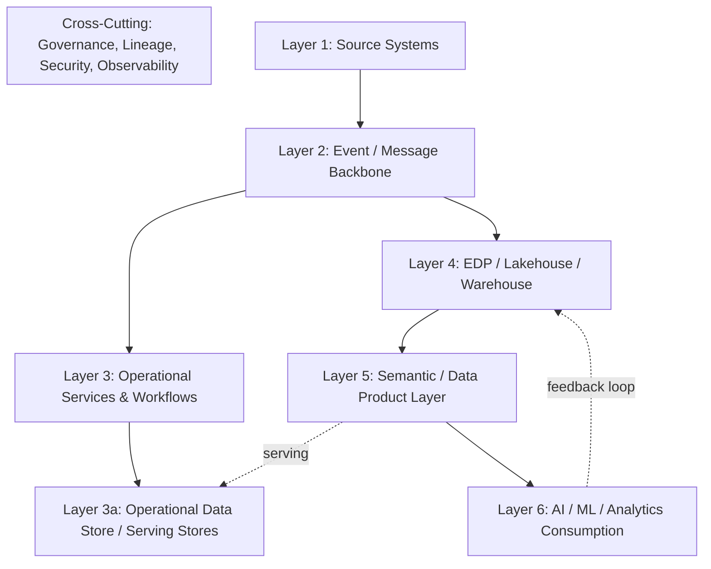

# Target-State Enterprise Architecture

A reference architecture for how enterprise data platforms and operational platforms coexist. Seven layers, each with a distinct responsibility and distinct operational characteristics; governance, lineage, security, and observability cut across all of them. This is an architectural pattern rather than a vendor recommendation. The cloud mappings below show how the conceptual layers land on real services.

<figure markdown="span">
  { width="100%" }
  <figcaption>Seven-layer reference architecture: operational platform (left), enterprise data platform (right)</figcaption>
</figure>

## The Seven Layers

```mermaid
graph TB
    subgraph "Cross-Cutting: Governance, Lineage, Security, Observability"
        direction TB
    end

    A["Layer 1: Source Systems"] --> B["Layer 2: Event / Message Backbone"]
    B --> C["Layer 3: Operational Services & Workflows"]
    B --> E["Layer 4: EDP / Lakehouse / Warehouse"]
    C --> D["Layer 3a: Operational Data Store / Serving Stores"]
    E --> F["Layer 5: Semantic / Data Product Layer"]
    F --> G["Layer 6: AI / ML / Analytics Consumption"]
    G -.-> |"feedback loop"| E
    F -.-> |"serving"| D
```

### Layer 1: Source Systems

The origin of all data. ERP, CRM, core banking, payments, custom applications. These systems own their operational data and emit changes via events, CDC, or batch extracts. Source systems are producers: they should not be aware of downstream consumers, and data flows out via events or CDC, never via direct queries from downstream platforms.

### Layer 2: Event / Message Backbone

The connective tissue. Kafka, Pub/Sub, Event Hubs, or equivalent. Every operational event and data change flows through this layer, which decouples producers from consumers. Operational services and the EDP consume from the same backbone independently.

### Layer 3: Operational Services and Workflows

Business process execution. Workflow engines, microservices, case management, payments processing. These are the systems that "run the business." They own current state, process transactions, and serve live operations, and they do not query the EDP for operational decisions.

### Layer 3a: Operational Data Store / Serving Stores

Purpose-built stores for operational access patterns. Low-latency lookups, transactional consistency, high concurrency. The ODS is not the EDP: it holds current-state, denormalized, access-optimized data for operational use, fed by the EDP or by source systems directly depending on the use case.

### Layer 4: EDP / Lakehouse / Warehouse

The analytical heart. Raw ingestion (bronze), cleansed and conformed (silver), business-ready (gold). Historical, governed, integrated. Everything here is optimized for analytical throughput, historical depth, and governance, not for transactional workloads, point lookups, or sub-second responses.

### Layer 5: Semantic / Data Product Layer

Governed, documented, discoverable data products. Each product has a defined owner, schema, SLA, and quality contract. Data products are the interface between the EDP and its consumers: stable, versioned datasets that hide the complexity of the layers beneath them.

### Layer 6: AI / ML / Analytics Consumption

The consumers. BI dashboards, data science notebooks, ML training pipelines, feature stores, analytics applications. Consumers access data through data products rather than querying raw layers directly. Feature stores bridge the gap between analytical data and low-latency serving for ML models.

### Cross-Cutting Concerns

Governance, lineage, security, and observability span all layers:

| Concern | What It Covers |
|---------|---------------|
| **Governance** | Data cataloging, ownership, access policies, data quality rules |
| **Lineage** | End-to-end traceability from source to consumption |
| **Security** | Authentication, authorization, encryption, column-level security, row-level security |
| **Observability** | Pipeline health, data freshness, query performance, SLO monitoring |

## Cloud-Specific Mappings

### Google Cloud Platform

<figure markdown="span">
  { width="100%" }
  <figcaption>Target-state architecture mapped to GCP services</figcaption>
</figure>

| Layer | GCP Services |
|-------|-------------|
| Event backbone | Pub/Sub, Dataflow |
| Operational services | Cloud Run, GKE, Cloud Functions |
| Operational data store | Cloud SQL, Firestore, Memorystore |
| EDP / Warehouse | BigQuery, Cloud Storage (lakehouse) |
| Semantic / Data products | BigQuery datasets + Dataplex, Analytics Hub |
| AI / ML | Vertex AI, Feature Store, BigQuery ML |
| Governance | Dataplex, Data Catalog, DLP API |

### Microsoft Azure

<figure markdown="span">
  { width="100%" }
  <figcaption>Target-state architecture mapped to Azure services (Databricks + Unity Catalog)</figcaption>
</figure>

| Layer | Azure Services |
|-------|---------------|
| Event backbone | Event Hubs, Service Bus |
| Operational services | Azure Functions, AKS, Logic Apps |
| Operational data store | Azure SQL, Cosmos DB, Redis Cache |
| EDP / Warehouse | Azure Databricks (Unity Catalog), Synapse, ADLS Gen2 |
| Semantic / Data products | Unity Catalog datasets, Databricks SQL |
| AI / ML | Azure ML, Databricks Feature Store, Azure OpenAI |
| Governance | Microsoft Purview, Unity Catalog |
