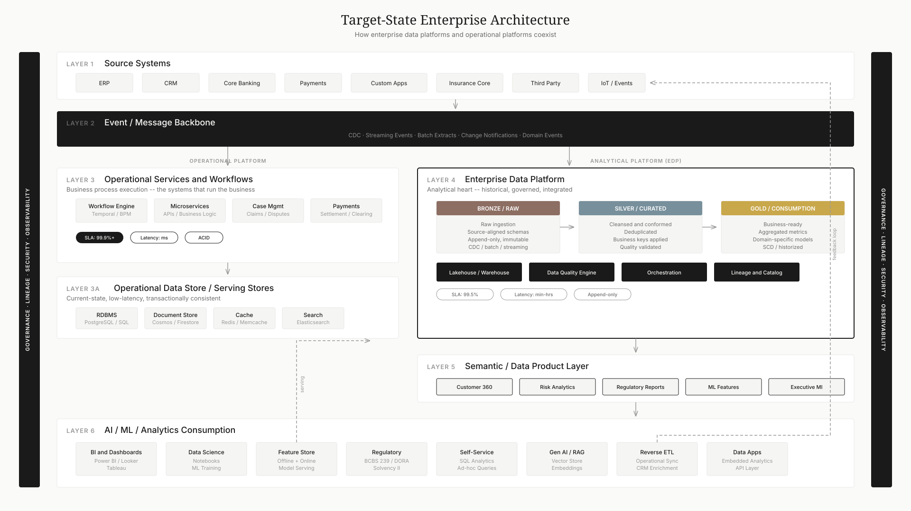
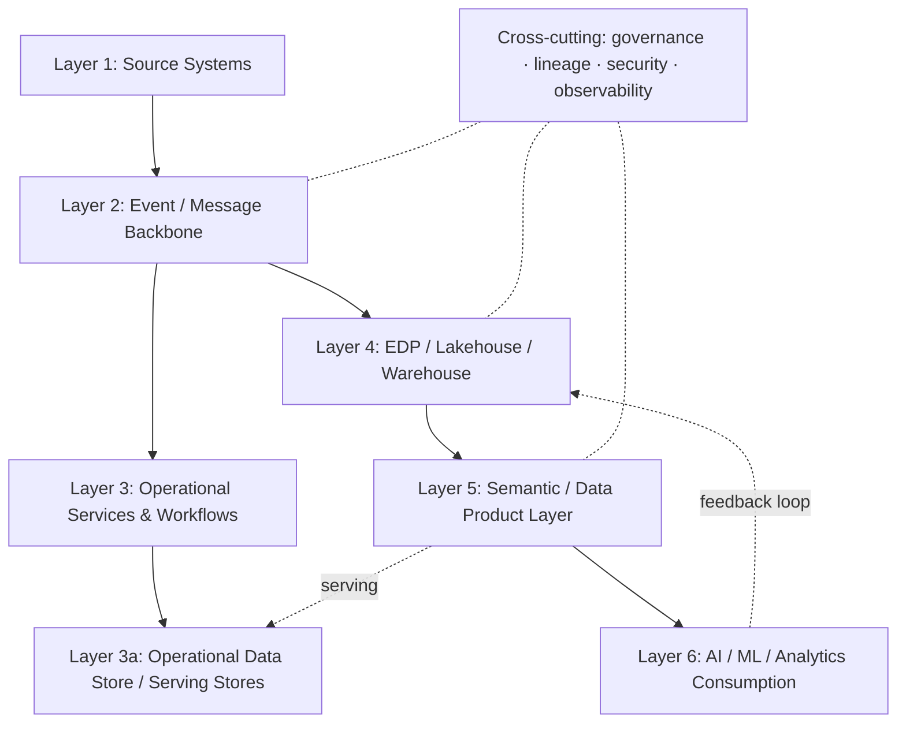
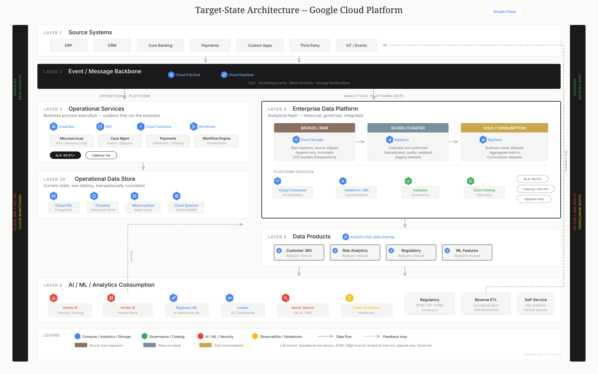
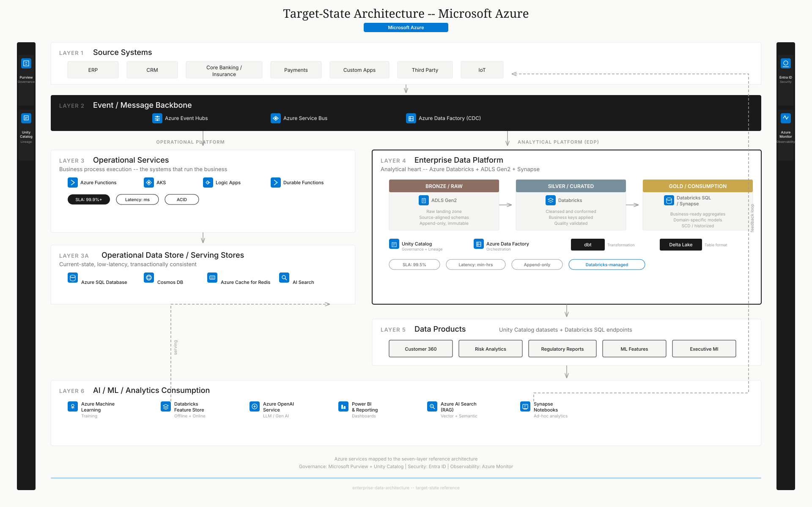

# Target-State Enterprise Architecture

A reference architecture for how enterprise data platforms and operational platforms coexist. Seven layers, each with a distinct responsibility and distinct operational characteristics; governance, lineage, security, and observability cut across all of them. This is an architectural pattern rather than a vendor recommendation. The cloud mappings below show how the conceptual layers land on real services.

<figure class="hero-figure">
  
  <figcaption>Seven-layer reference architecture: operational platform (left), enterprise data platform (right)</figcaption>
</figure>

## The Seven Layers

```mermaid
graph TB
    A["Layer 1: Source Systems"] --> B["Layer 2: Event / Message Backbone"]
    B --> C["Layer 3: Operational Services & Workflows"]
    B --> E["Layer 4: EDP / Lakehouse / Warehouse"]
    C --> D["Layer 3a: Operational Data Store / Serving Stores"]
    E --> F["Layer 5: Semantic / Data Product Layer"]
    F --> G["Layer 6: AI / ML / Analytics Consumption"]
    G -.-> |"feedback loop"| E
    F -.-> |"serving"| D
    XC["Cross-cutting: governance · lineage · security · observability"]
    XC -.- B
    XC -.- E
    XC -.- F
```

### Layer 1: Source Systems

The origin of all data. ERP, CRM, core banking, payments, custom applications. These systems own their operational data and emit changes via events, CDC, or batch extracts. Producers should not be technically coupled to individual downstream implementations: data flows out via events or CDC, never via direct queries from downstream platforms. Decoupling is not ignorance, though. Producers remain accountable for the contracts they publish (schema compatibility, quality SLOs, deprecation windows) and for managing consumer impact when those contracts change.

### Layer 2: Event / Message Backbone

The connective tissue. Kafka, Pub/Sub, Event Hubs, or equivalent. Every operational event and data change flows through this layer, which decouples producers from consumers. Operational services and the EDP consume from the same backbone independently.

*Decisions at this layer: [integration patterns](coexistence-patterns.md), [zero-ETL vs CDC](../patterns/open-formats.md).*

### Layer 3: Operational Services and Workflows

Business process execution. Workflow engines, microservices, case management, payments processing. These are the systems that "run the business." They own current state, process transactions, and serve live operations, and they do not query the EDP for operational decisions.

### Layer 3a: Operational Data Store / Serving Stores

Purpose-built stores for operational access patterns. Low-latency lookups, transactional consistency, high concurrency. The ODS is not the EDP: it holds current-state, denormalized, access-optimized data for operational use, fed by the EDP or by source systems directly depending on the use case.

*Decisions at this layer: [serving layer blueprint](serving-layer.md), [EDP Is Not an ODS](../position/edp-is-not-an-ods.md).*

### Layer 4: EDP / Lakehouse / Warehouse

The analytical heart. Raw ingestion (bronze), cleansed and conformed (silver), business-ready (gold). Historical, governed, integrated. Everything here is optimized for analytical throughput, historical depth, and governance, not for transactional workloads, point lookups, or sub-second responses. Storage at this layer is increasingly open table formats with a catalog in front; see [Open Formats and Catalogs](../patterns/open-formats.md) for why the catalog choice now matters as much as the engine choice.

*Decisions at this layer: [catalog selection](../patterns/open-formats.md), [cost architecture](../patterns/cost-architecture.md).*

### Layer 5: Semantic / Data Product Layer

Governed, documented, discoverable data products. Each product has a defined owner, schema, SLA, and quality contract. Data products are the interface between the EDP and its consumers: stable, versioned datasets that hide the complexity of the layers beneath them.

One layer, three distinct abstractions. It helps to separate them even when one product implements all three: **data products** are owned, governed consumption units with a defined consumer problem, lifecycle, and accountability; the **semantic layer** is the consistent business meaning (metrics, entities, blessed joins) those products expose; and **access interfaces** are the delivery mechanics (SQL, APIs, events, files, MCP resources, vector search). Conflating them is how "data product" degrades into "documented table."

The semantic abstraction is gaining weight. Metric and entity definitions, once a BI-tool convenience, are becoming governed artifacts in their own right, because they are the interface BI copilots and AI agents consume. The Open Semantic Interchange (OSI) specification, published in early 2026, aims to make those definitions portable across tools. Treat business definitions like schemas: owned, versioned, and reviewed.

*Decisions at this layer: [data contracts](../patterns/data-contracts.md), [agent access](agent-access.md).*

### Layer 6: AI / ML / Analytics Consumption

The consumers. BI dashboards, data science notebooks, ML training pipelines, feature stores, analytics applications, and now agents. Consumers access data through data products rather than querying raw layers directly. Feature stores bridge the gap between analytical data and low-latency serving for ML models.

*Decisions at this layer: [workload routing](../decisions/decision-tree.md), [agents as consumers](agent-access.md).*

### Cross-Cutting Concerns

Governance, lineage, security, and observability span all layers:

| Concern | What It Covers |
|---------|---------------|
| **Governance** | Data cataloging, ownership, access policies, data quality rules |
| **Lineage** | End-to-end traceability from source to consumption |
| **Security** | Authentication, authorization, encryption, column-level security, row-level security |
| **Observability** | Pipeline health, data freshness, query performance, SLO monitoring |

## Cloud-Specific Mappings

### Google Cloud Platform

<figure class="hero-figure">
  
  <figcaption>Target-state architecture mapped to GCP services</figcaption>
</figure>

| Layer | GCP Services |
|-------|-------------|
| Event backbone | Pub/Sub, Dataflow |
| Operational services | Cloud Run, GKE, Cloud Functions |
| Operational data store | Cloud SQL, Firestore, Memorystore |
| EDP / Warehouse | BigQuery, Cloud Storage (lakehouse) |
| Semantic / Data products | BigQuery datasets + Dataplex, Analytics Hub |
| AI / ML | Vertex AI, Feature Store, BigQuery ML |
| Governance | Dataplex, Data Catalog, DLP API |

### Microsoft Azure

<figure class="hero-figure">
  
  <figcaption>Target-state architecture mapped to Azure services (Databricks + Unity Catalog)</figcaption>
</figure>

| Layer | Azure Services |
|-------|---------------|
| Event backbone | Event Hubs, Service Bus |
| Operational services | Azure Functions, AKS, Logic Apps |
| Operational data store | Azure SQL, Cosmos DB, Redis Cache |
| EDP / Warehouse | Azure Databricks (Unity Catalog), ADLS Gen2, Microsoft Fabric / OneLake (Synapse's successor path) |
| Semantic / Data products | Unity Catalog datasets, Databricks SQL, Power BI semantic models |
| AI / ML | Azure ML, Databricks Feature Store, Azure OpenAI |
| Governance | Microsoft Purview, Unity Catalog |

### Amazon Web Services

<figure class="hero-figure">
  
  <figcaption>Target-state architecture mapped to AWS services</figcaption>
</figure>

| Layer | AWS Services |
|-------|-------------|
| Event backbone | MSK (managed Kafka), Kinesis |
| Operational services | Lambda, EKS, Step Functions |
| Operational data store | Aurora / RDS, DynamoDB, ElastiCache |
| EDP / Warehouse | S3 with Iceberg tables, Redshift, Athena, EMR |
| Semantic / Data products | Glue Data Catalog, Lake Formation grants, DataZone |
| AI / ML | SageMaker, Bedrock |
| Governance | Lake Formation, Glue Data Catalog, DataZone |

The layer responsibilities are identical across all three clouds; only the service names change. For worked applications of these mappings, see the scenario blueprints.
