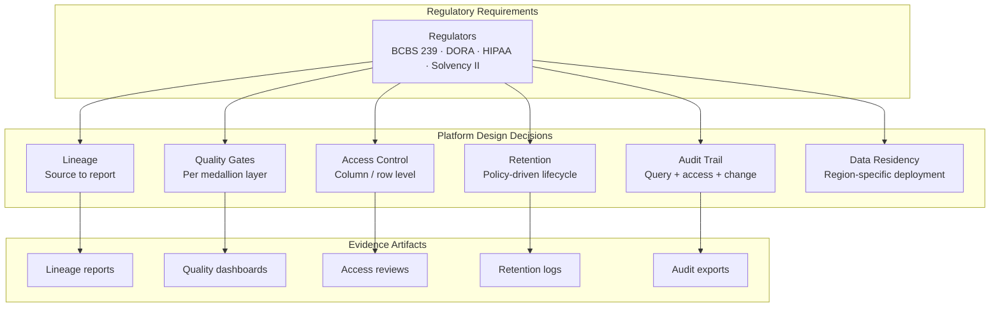

# Regulatory Compliance Patterns for Data Platforms

## Executive Summary

- Data platform architecture decisions directly determine compliance outcomes -- choose the wrong storage model and no amount of policy documentation will satisfy regulators
- This section maps regulatory requirements to platform design choices, not to specific cloud controls
- Three industries covered: banking (BCBS 239, DORA), healthcare (HIPAA), insurance (Solvency II)
- The EDP's append-only, historized, lineage-tracked design naturally satisfies many regulatory requirements that operational platforms struggle with
- Compliance is an architecture feature, not a bolt-on audit exercise

## Cross-Industry Compliance Matrix

Regulators across industries ask surprisingly similar questions. The specifics differ (BCBS 239 cares about risk data aggregation, HIPAA cares about protected health information), but the underlying architectural demands converge. This matrix maps common regulatory themes to the platform design decisions that satisfy them.

| Regulatory Theme | What Regulators Want | Platform Design Decision | Which Layer |
|---|---|---|---|
| Data lineage | Trace any number to its source | End-to-end lineage from source to consumption | Cross-cutting |
| Data quality | Accurate, complete, timely data | Quality gates at bronze/silver/gold boundaries | Layer 4 (EDP) |
| Access control | Least privilege, audit trail | Column/row-level security, IAM policies | Cross-cutting |
| Data retention | Keep data for mandated periods | Tiered storage with retention policies | Layer 4 (EDP) |
| Right to delete | GDPR Article 17 compliance | Soft delete with audit trail in append-only model | Layer 4 (EDP) |
| Audit trail | Who accessed what, when | Query logging, access auditing | Cross-cutting |
| Data residency | Data stays in mandated geography | Region-specific deployment, cross-region restrictions | Infrastructure |
| Incident reporting | Report breaches within mandated timeframes | Monitoring, alerting, incident workflows | Cross-cutting |
| Third-party risk | Manage vendor and outsourcing risk | Vendor assessment, contract requirements | Governance |
| Business continuity | Recover from failures | Backup, DR, multi-region redundancy | Infrastructure |

Notice that most themes map to cross-cutting concerns or Layer 4 (the EDP itself). This is not a coincidence. Regulators care about data governance, and governance is the EDP's primary job.

## How EDP Design Satisfies Compliance

The EDP is not compliant by accident. Its core design properties align with what regulators have been asking for decades.

**Append-only storage.** Regulators want to know what data looked like at a point in time. An append-only model preserves every version of every record. You never have to explain why you overwrote something, because you did not overwrite anything. This directly satisfies audit trail, data retention, and right-to-delete requirements (soft delete with a tombstone record, full history preserved).

**Historized data model.** Slowly changing dimensions, snapshot tables, and temporal joins are not just analytical conveniences. They are regulatory necessities. When a regulator asks "what was this customer's risk rating on March 15," you need the answer without reconstructing it from transaction logs.

**End-to-end lineage.** Every transformation from source to consumption layer is tracked, versioned, and queryable. This is the difference between telling a regulator "we think this number came from system X" and showing them a lineage graph that proves it.

**Governed access model.** Column-level security, row-level filtering, and role-based access are built into the platform layer, not bolted on per report. When an auditor asks who can see customer social security numbers, the answer is a policy query, not a spreadsheet maintained by hand.

**Quality gates at layer boundaries.** Data quality checks at bronze-to-silver and silver-to-gold transitions catch issues before they propagate to regulatory reports. A failed quality gate stops bad data from reaching consumption -- which is infinitely better than discovering the problem during a regulatory examination.

## Industry-Specific Guides

Each industry has unique regulatory requirements that go beyond the common themes above. These guides map specific regulations to platform design decisions:

- [Banking: BCBS 239 and DORA](banking.md) -- risk data aggregation, reporting accuracy, digital operational resilience
- [Healthcare: HIPAA](healthcare.md) -- protected health information, minimum necessary standard, breach notification
- [Insurance: Solvency II](insurance.md) -- risk capital reporting, data quality for actuarial models, regulatory submissions

## Compliance vs Implementation

This guide covers design decisions -- the architectural choices that determine whether a platform can satisfy regulatory requirements regardless of which cloud or technology stack you deploy on.

For implementation-specific patterns (GCP controls, CMEK encryption, VPC Service Controls, audit logging configuration), see [reference-data-platform-gcp](https://github.com/sunilp/reference-data-platform-gcp). That repo translates the design decisions documented here into concrete infrastructure-as-code and cloud-native controls.

The separation is deliberate. Design decisions are stable across cloud providers and survive technology migrations. Implementation details change when you switch from GCP to Azure, or when a cloud provider deprecates a service. Keep the two concerns separate, and your compliance posture survives platform evolution.
