# Business Capability Map

## Executive Summary

- This map answers one question for non-technical leaders: which platform owns which business capability
- It eliminates the recurring debate where every new requirement defaults to "build it on the data platform"
- Platform ownership is determined by workload characteristics (latency, mutation, SLA), not by where the best data lives
- When a capability spans platforms, the map forces explicit ownership boundaries before anyone writes code
- Print this. Reference it in steering committees. It saves months of architectural rework per misplaced workload.

```mermaid
graph LR
    subgraph EDP["Enterprise Data Platform"]
        direction TB
        E1[Customer 360]
        E2[Regulatory Reporting]
        E3[Executive MI]
        E4[ML Training Data]
        E5[Self-Service Analytics]
    end

    subgraph OPS["Operational Platform"]
        direction TB
        O1[Payments]
        O2[Case Management]
        O3[Workflow State]
        O4[Transaction Processing]
    end

    subgraph SRV["Serving Layer"]
        direction TB
        S1[Real-Time Decisioning]
        S2[API Serving]
        S3[Feature Serving]
        S4[Embedded Analytics]
    end

    EDP -->|"data products"| SRV
    OPS -->|"events"| EDP
    SRV -->|"enrichment"| OPS
```

## The Capability Matrix

| Business Capability | Platform Owner | Why This Platform |
|---|---|---|
| Customer 360 / Single Customer View | EDP | Cross-domain integration, historical depth |
| Regulatory Reporting (BCBS 239, DORA, Solvency II) | EDP | Lineage, auditability, governed datasets |
| Executive Management Information | EDP | Aggregated, cross-domain metrics |
| Data Science / AI Model Training | EDP + ML Platform | Historized training data from EDP, compute on ML platform |
| Self-Service Analytics | EDP | Governed, documented datasets for business users |
| Fraud Detection (real-time) | Streaming + Operational | Sub-second scoring during transaction |
| Fraud Investigation (post-hoc) | EDP | Historical pattern analysis across domains |
| Operational Workflow / Case Management | Operational / Workflow Platform | Mutable state, human tasks, SLA tracking |
| Payments / Transaction Processing | Operational | ACID, low-latency, high availability |
| Real-Time Decisioning (pricing, offers) | Serving Layer | Low-latency serving, fed by EDP-computed features |
| API Serving for Customer Apps | Serving Layer | High concurrency, low latency, always-on |
| Data Quality Monitoring | EDP | Cross-domain quality rules, historical trends |
| Master Data Management | Shared (MDM source, EDP consumer) | Operational ownership, analytical consumption |
| Embedded Analytics | Serving Layer + EDP | EDP produces, serving layer delivers at app speed |
| Gen AI / RAG Applications | ML Platform + Vector Store | Embeddings from EDP data, served from vector DB |

## How to Read This Map

**EDP** means the enterprise data platform owns the data and the workload runs against it. The platform is optimized for throughput, historical depth, and governance. If a capability maps here, expect batch or near-real-time latency, not sub-second response times.

**Operational** means a purpose-built operational system with its own SLAs, its own data model, and its own uptime guarantees. These systems process transactions, manage mutable state, and serve live business operations. The EDP ingests from them -- it does not replace them.

**Serving Layer** means data originates in the EDP but is served through purpose-built low-latency infrastructure. APIs, caches, materialized views, feature stores -- whatever the access pattern demands. The EDP computes; the serving layer delivers.

**Shared** means explicit ownership boundaries between platforms with well-defined data flows. Neither platform fully owns the capability. When you see "Shared," the first question is always: who owns the data, and who owns the SLA?

## Using This Map in Steering Committees

Print it. Put it on the wall. Reference it when stakeholders request new capabilities.

When a request comes in that maps to "EDP" but stakeholders expect operational SLAs -- sub-second latency, 99.99% uptime, real-time mutation -- that is a positioning conversation, not a technology decision. The data platform team does not need to evaluate new tools. Leadership needs to agree on which platform owns the workload.

When a request maps to "Shared," define the boundary before building. Who owns the data? Who owns the SLA? How does data flow between platforms? Without these answers, both teams will build half a solution and blame each other when it breaks. Every "Shared" capability needs a one-page data flow agreement signed off by both platform owners before development starts.

When a request does not appear on this map, that is a signal to stop and classify it before assigning it to a team. Add the capability to the map, assign ownership, and document the reasoning. The map grows with the enterprise. An unmapped capability is an ungoverned capability.
