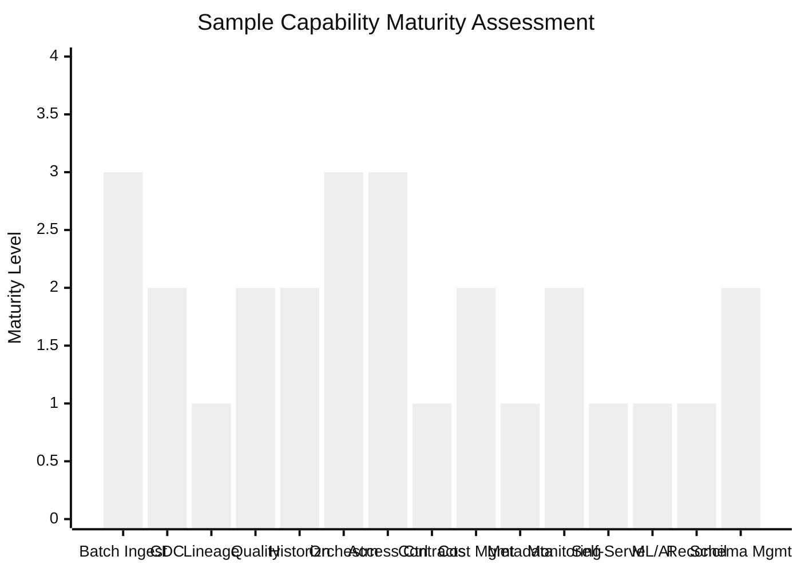

# Capability Maturity Assessment

## Executive Summary

- Platform maturity is not uniform. An organization can be Level 4 on batch ingestion and Level 1 on lineage. Treating the platform as a single maturity score hides the gaps that actually hurt.
- This assessment maps maturity to 15 individual capabilities, so each one is scored independently. The platform-level maturity model tells you where you are overall. This tells you where you are weak.
- Use it to identify specific capability gaps and prioritize investment. A Level 2 lineage capability blocks regulatory readiness regardless of how good your ingestion is.
- The most dangerous pattern is assuming maturity is uniform because one area is strong. Leaders see a well-orchestrated pipeline and conclude the platform is mature. Then a regulator asks for column-level lineage and nobody can produce it.

## Capability Maturity Matrix

Score each capability against four levels. Be honest -- the value of this exercise is proportional to how uncomfortable the results make you.

| Capability | Level 1: Fragmented | Level 2: Standardized | Level 3: Governed | Level 4: Enterprise-Grade |
|---|---|---|---|---|
| **Batch ingestion** | Manual scripts, ad-hoc extracts, tribal knowledge about source systems | Scheduled pipelines with basic monitoring, documented source connections | Self-serve ingestion with automated onboarding, templated connectors | Multi-source orchestrated ingestion, SLA-driven with automated failover |
| **CDC** | None, or manual full extracts pretending to be incremental | Basic CDC with polling or timestamp-based detection | Streaming CDC with schema evolution handled automatically | Real-time CDC with inline quality validation and guaranteed delivery |
| **Lineage** | None. Nobody knows where data comes from or who consumes it | Manual documentation that is already out of date | Automated technical lineage captured from pipeline metadata | Column-level lineage, impact analysis, regulatory-ready reporting |
| **Quality controls** | No checks. Data is assumed correct until someone complains | Basic row counts and null checks on critical tables | Automated quality gates at each layer transition, alerting on failures | Quality contracts with SLOs per dataset, trend analysis, consumer-facing dashboards |
| **Historization** | Overwrite. Yesterday's data is gone forever | Basic SCD Type 1 -- current state only, with some audit columns | SCD Type 2 or append-only patterns with valid-from/valid-to tracking | Bitemporal modeling with full audit history, correction tracking, and point-in-time queries |
| **Orchestration** | Cron jobs. Nobody knows the dependency graph | Airflow or Composer with basic DAGs, manual retry on failure | Dependency-aware orchestration with retry logic, SLA tracking, and alert routing | Self-healing pipelines, dynamic scheduling based on data availability, cross-domain coordination |
| **Access control** | Shared credentials or wide-open service accounts | Role-based access at the dataset level, manually maintained | Column-level and row-level security policies, access request workflows | Attribute-based access control, automated periodic review, dynamic masking |
| **Data contracts** | None. Producers change schemas whenever they want | Informal agreements -- "we'll let you know before we change things" (they won't) | Formal schemas with versioning, published SLAs, and notification policies | Contracts enforced in CI/CD, breaking changes blocked until consumers acknowledge |
| **Cost management** | No visibility. Data infrastructure costs are buried in cloud bills | Monthly bill review, someone investigates spikes after they happen | Chargeback by domain or team, query cost limits, storage tiering | Cost per data product, predictive cost modeling, automated optimization recommendations |
| **Metadata** | None. Data exists but nobody can find it or understand what it means | Basic catalog with table-level descriptions, manually maintained | Automated metadata capture from pipelines, searchable catalog with freshness indicators | Unified business, technical, and operational metadata with usage analytics and lineage integration |
| **Pipeline monitoring** | None. Failures are discovered when a consumer complains | Job success/failure tracking with email notifications | SLA tracking per pipeline, freshness monitoring, automated escalation | Predictive monitoring with anomaly detection, capacity forecasting, and consumer impact analysis |
| **Self-service access** | None. All data access requires a ticket to the platform team | Shared tables available in a warehouse, no documentation or guarantees | Governed datasets with documentation, quality indicators, and access request workflows | Data marketplace with contracts, SLAs, usage metrics, and consumer feedback loops |
| **ML/AI integration** | None. Data scientists extract raw data and build everything from scratch | Ad-hoc notebook access to warehouse tables, no feature management | Offline feature store with versioned feature definitions and governed training datasets | Online and offline feature stores, production serving integration, feedback loops from predictions |
| **Reconciliation** | None. Nobody validates that data in the platform matches the source | Manual spot checks when something looks wrong, usually after a business decision was already made | Automated cross-source reconciliation checks at defined intervals | Continuous reconciliation with tolerance thresholds, automated alerting, and root cause tracking |
| **Schema management** | Ad-hoc changes. Someone alters a table in production and hopes nothing breaks | Documented change process -- changes are reviewed but not validated automatically | Schema evolution policies with compatibility rules (backward, forward, full) | Automated compatibility validation in CI/CD, schema registry with versioning and deprecation |

## How to Use This Assessment

Score each of the 15 capabilities from 1 to 4 based on your current state. Not your planned state. Not where you will be next quarter. Where you are right now.

**Step 1: Score honestly.** Walk through each row with the people who actually operate the capability, not the people who designed it. Architects will tell you Level 3. Operators will tell you the truth.

**Step 2: Identify urgent gaps.** Any capability below Level 2 is a gap that will bite you. Level 1 means no standard process exists -- you are relying on individuals, not systems. These capabilities break when someone goes on holiday.

**Step 3: Flag compliance-critical capabilities.** Lineage, access control, quality controls, historization, and reconciliation have regulatory implications. If any of these sit at Level 2, they need to reach Level 3 before your next audit, not before your next roadmap cycle.

**Step 4: Prioritize governance before consumption.** It is tempting to invest in self-service access and ML integration because they are visible to stakeholders. But self-service without quality controls produces self-service garbage. ML without lineage produces models nobody can explain to a regulator. Build the governance foundation first.

**Step 5: Reassess quarterly.** Capability maturity changes. It also regresses -- a team reorganization, a key departure, or a migration can drop a capability by a full level. Track movement over time, not just the current snapshot.

## Common Patterns

These patterns show up in nearly every assessment. Recognizing yours is the first step toward fixing it.

### Strong ingestion, weak governance

Data gets into the platform efficiently. Pipelines are reliable, orchestration works, monitoring catches failures. But nobody knows what the data means, who owns it, or whether it is correct. The platform is a well-oiled machine that produces undocumented, ungoverned output. Business users do not trust it, so they maintain their own spreadsheets alongside it.

### Strong BI, weak contracts

Dashboards work. Executives get their reports. Then an upstream team renames a column and half the dashboards break on Monday morning. There is no contract between producer and consumer -- just implicit dependencies that work until they do not. The BI team spends more time fixing breakages than building insights.

### Strong security, weak lineage

Access control is tight. PII is masked. Audit logs exist. But when a regulator asks "show me every system this customer's data flows through," nobody can answer without a two-week manual investigation. Security without lineage means you can prove who accessed data but not where it came from or where it went.

### Strong platform, weak operations

The architecture is sound. The technology choices are defensible. The platform could handle ten times the current load. But nobody owns incident response. Alert fatigue has set in because every quality check fires a notification and nobody triages them. Pipeline failures are resolved by the person who happens to notice, not by a defined process. Technical excellence without operational discipline produces an impressive platform that is unreliable in practice.

## Sample Assessment Visualization

The chart below shows a typical enterprise assessment -- strong in some areas, weak in others. The unevenness is the point. If your assessment produces a flat line, you either have a genuinely mature platform or you are not being honest.

This sample reflects the "strong ingestion, weak governance" pattern. Batch ingestion and orchestration are at Level 3. Access control is at Level 3 because security invested in it independently. But lineage, contracts, metadata, and self-service are all at Level 1 -- the platform ingests and secures data effectively, but nobody can find it, understand it, or trust it without asking the platform team.

The fix is not to improve ingestion further. The fix is to raise lineage, metadata, and contracts to Level 2 before doing anything else. The highest-value investment is always in the weakest governance capability, not in the strongest operational one.
