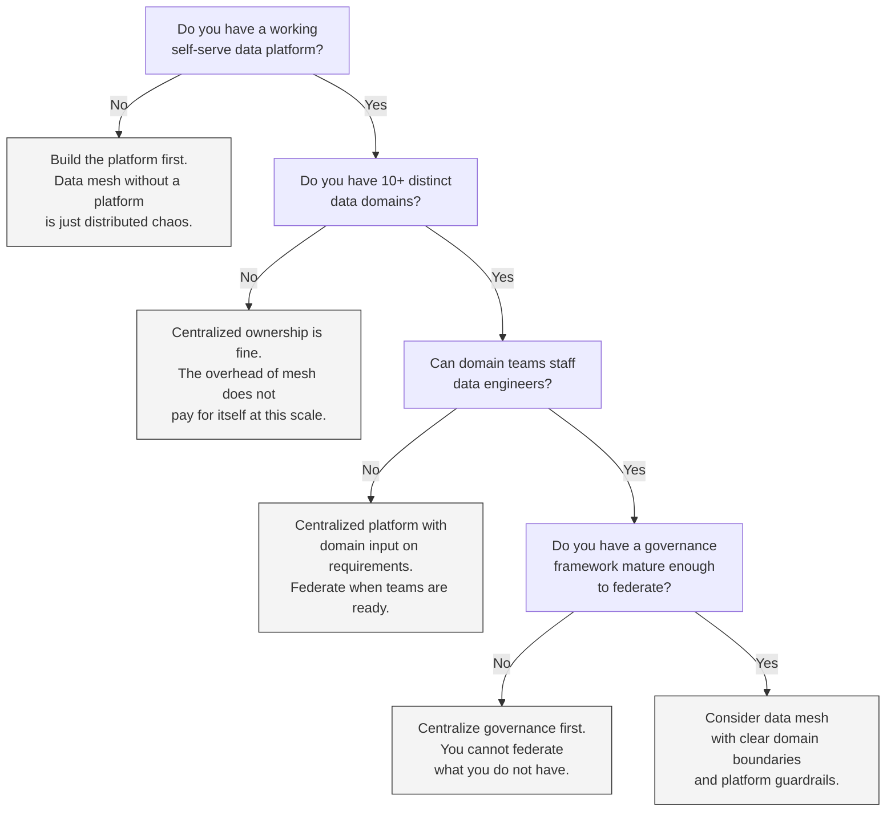

# Data Mesh: When It Works, When It Doesn't

## Executive Summary

- Data mesh is an organizational model, not a technology platform
- It works when domain teams are mature enough to own data products end-to-end
- It fails when used as a rebrand for existing silos or when there is no shared platform underneath
- Most enterprises need centralized platform infrastructure with federated data ownership -- not pure data mesh
- The question is not "should we do data mesh?" but "which parts of data mesh apply to our maturity level?"

## What Data Mesh Actually Is

Data mesh is an organizational and architectural approach introduced by Zhamak Dehghani. It has four principles. All four must be present. Adopting one or two and calling it "data mesh" is cargo-culting.

**Domain-oriented ownership.** Data is owned by the teams closest to its origin. The payments team owns payment data. The customer team owns customer data. Ownership means accountability for quality, freshness, schema, and availability -- not just "we have a table."

**Data as a product.** Domain teams treat their data outputs as products with consumers. This means defined schemas, SLAs, documentation, discoverability, and quality guarantees. A dataset without a contract, an owner, and a consumer feedback loop is not a data product. It is a dump.

**Self-serve data platform.** A shared infrastructure layer provides the tooling domains need to build, deploy, and operate their data products without each team reinventing ingestion, transformation, storage, and governance from scratch. This is the part most organizations skip, and it is the part that makes everything else possible.

**Federated computational governance.** Governance policies are defined centrally but enforced computationally across domains. Not governance by committee. Not governance by wiki page. Automated policy enforcement embedded in the platform -- schema validation, quality checks, access controls, lineage tracking -- that domains cannot bypass.

## When Data Mesh Works

All of these conditions must be true. Not most. All.

**The organization has 10+ distinct data domains with clear ownership.** Data mesh introduces organizational overhead -- domain teams staffing data engineers, cross-domain interoperability contracts, federated governance infrastructure. With fewer than 10 domains, centralized ownership is simpler, cheaper, and faster. The overhead of mesh does not pay for itself.

**Domain teams have engineering capability to build and operate data pipelines.** "Own your data" requires engineers who can build, test, deploy, monitor, and maintain data pipelines and products. If domain teams lack this capability, they will produce low-quality datasets that nobody trusts. Assigning ownership without staffing for it is organizational theater.

**A self-serve data platform already exists.** This is the prerequisite most enterprises ignore. You need centralized infrastructure first -- ingestion frameworks, transformation tooling, storage, cataloging, quality monitoring, access management -- before you can federate ownership on top of it. Without the platform, every domain builds from scratch. You get 15 different ingestion patterns, 8 different quality frameworks, and no interoperability.

**Leadership commits to funding data engineering in every domain team.** Data mesh is expensive. Every domain needs data engineers, and those engineers need to be good enough to build production-grade data products. If leadership approves the org model but not the headcount, domain teams will cut corners. The result is worse than what you started with.

**Governance framework is mature enough to federate.** You cannot federate what you do not have. If there are no central data quality standards, no schema conventions, no access control policies, and no lineage requirements, then "federated governance" means "no governance." You need a working governance baseline before you distribute enforcement to domains.

## When Data Mesh Fails

These are not hypothetical risks. Every one of these happens regularly in enterprises that adopt data mesh for the wrong reasons.

**"We renamed our silos as domains."** The org chart stays the same. Teams that were already siloed now call themselves "domains." There is no shared platform, no interoperability standard, and no cross-domain data contracts. This is the old world with new vocabulary. Nothing improves.

**"We decentralized without a platform."** Leadership declared data mesh. Domain teams were told to own their data. But there is no self-serve platform underneath. Every team builds its own ingestion, its own transformation framework, its own monitoring. Twelve months later you have 10 incompatible data stacks, no cross-domain joins are possible, and the platform team has been dissolved because "domains own everything now."

**"We have 3 domains."** Three domain teams do not need federated governance, cross-domain contracts, or self-serve platform infrastructure. A centralized data team with good stakeholder relationships handles this more effectively at a fraction of the cost. Data mesh is organizational machinery for organizational scale. Small scale does not need it.

**"Domain teams have no data engineering skills."** Marketing was told they own marketing data. They have analysts who write SQL. They do not have engineers who can build pipelines, implement data contracts, monitor freshness, or handle schema evolution. The result is brittle pipelines, undocumented datasets, and a "data product" that breaks every Tuesday because someone changed a column name upstream.

**"We federated governance before we had governance."** There were no central standards for data quality, naming, access control, or lineage. Leadership said "federate governance to the domains." Each domain invented its own standards -- or more commonly, had no standards at all. There is no quality floor. There is no interoperability. Cross-domain analytics is impossible because nothing conforms to anything.

## The Pragmatic Middle Ground

Most enterprises do not need pure data mesh. They need federated ownership on centralized infrastructure. This is what works in practice.

**Centralized data platform managed by a platform team.** One team builds and operates the shared infrastructure -- storage, compute, ingestion frameworks, transformation tooling, cataloging, quality monitoring, access management. This is the EDP. It is not optional. It is the foundation.

**Domain teams own their data products.** Domains define their schemas, set quality thresholds, write documentation, and respond to consumer feedback. They own the "what" -- the content, quality, and business logic of their data. They do not own the "how" -- the platform infrastructure that runs it.

**Platform team provides self-serve tooling.** Ingestion connectors, transformation templates, publishing pipelines, quality dashboards, catalog integrations. The platform team makes it easy for domain teams to produce data products without building infrastructure. The interface is declarative: domain teams define what they want, the platform handles execution.

**Governance is centrally defined, locally enforced.** The central governance team sets the standards -- naming conventions, quality thresholds, classification rules, access policies, lineage requirements. These standards are enforced computationally through the platform. Domain teams do not get to opt out. But domain teams handle domain-specific decisions within those guardrails.

**This is not pure data mesh.** It borrows the best ideas -- domain ownership, data as a product, computational governance -- and runs them on centralized infrastructure instead of asking every domain to build their own stack. It works because it matches the reality of most enterprises: uneven domain maturity, constrained data engineering talent, and a need for cross-domain interoperability that pure decentralization cannot deliver.

## Decision Framework

Use this flowchart to determine the right model for your organization.

Most enterprises land at one of the "No" branches. That is not failure. That is an honest assessment of where you are. Start there, mature the prerequisites, and adopt mesh principles incrementally as conditions allow.

The worst outcome is not "we are not doing data mesh." The worst outcome is "we declared data mesh, skipped the prerequisites, and now have a more expensive version of the same mess."
