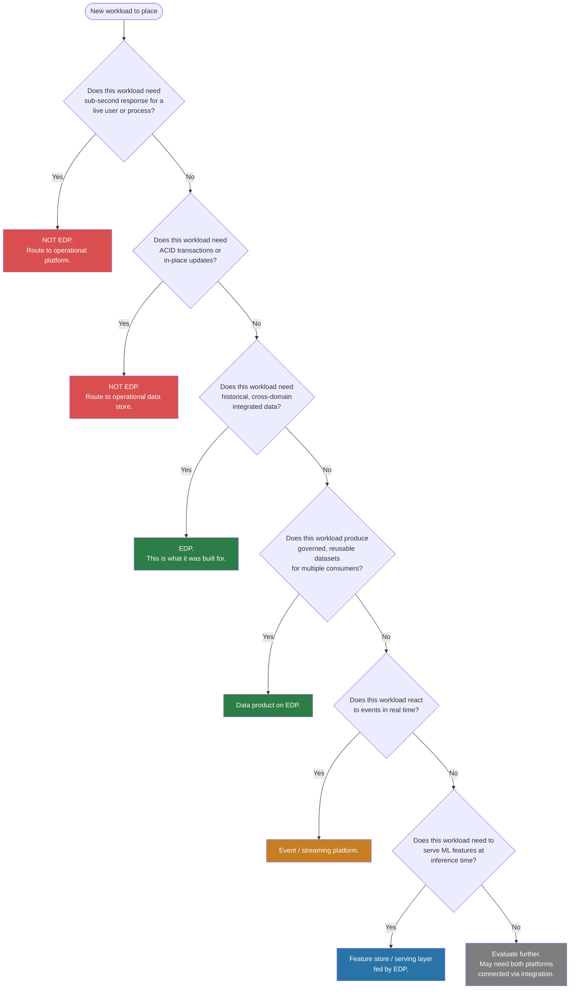

# Where Does This Workload Belong?

## Executive Summary

- Not every workload belongs on the enterprise data platform. The EDP solves analytical, historical, and governance problems -- it is not a general-purpose runtime.
- Latency requirements and mutation patterns are the two fastest ways to determine platform fit. Get these wrong and no amount of engineering will compensate.
- This decision tree gives architects a repeatable, defensible process for routing workloads to the right platform instead of defaulting to "put it in the data lake."
- Some workloads genuinely span both platforms. For those, the answer is not to pick one -- it is to define the boundary explicitly and connect them cleanly.
- When the answer is unclear, separate and connect. It is always cheaper to build an integration than to untangle a platform that does both jobs poorly.

## Decision Tree

Use this flowchart to route a workload. Start at the top and follow the branches.

The tree is deliberately sequential. Sub-second latency and ACID transactions are disqualifying factors for EDP -- they come first because they are non-negotiable. Only after ruling those out do you evaluate whether the workload fits EDP's strengths.

## Quick Reference Table

For common workloads, the answer is already known. Use this table to skip the tree when the pattern is familiar.

| Workload | Platform | Why |
|----------|----------|-----|
| Customer 360 analytics | EDP | Cross-domain integration across all product lines, historical depth |
| Payment processing | Operational | Sub-second latency, ACID transactions, zero tolerance for delay |
| Fraud scoring at transaction time | Streaming + operational | Real-time event reaction with millisecond SLA, model scores served from feature store |
| Regulatory reporting (BCBS 239, DORA) | EDP | Historical data, lineage, cross-domain joins, audit trail |
| Case management workflow | Operational / workflow engine | State machine with in-place updates, user-facing process |
| ML model training | EDP + ML platform | EDP provides governed training data, ML platform handles compute and experimentation |
| Executive dashboards | EDP | Aggregated cross-domain metrics, refresh cadence in minutes not milliseconds |
| API serving for mobile app | Serving layer (fed by EDP) | Sub-second reads, high concurrency -- EDP computes, serving layer delivers |
| Real-time inventory | Operational | Current-state system with constant updates, not an analytical workload |
| Historical trend analysis | EDP | Time-series queries over months or years of integrated data |

## Decision Principles

### 1. Data gravity does not determine platform fit

Just because data is in the EDP does not mean it should be served from there. The EDP is where data is integrated and governed. Serving is a separate concern with separate requirements. A gold-layer table with perfect data quality is still the wrong answer if the consumer needs 50ms response times.

### 2. Latency requirements are non-negotiable

If a workload needs sub-second response, the EDP is the wrong platform regardless of where the data lives. This is not a limitation to engineer around. It is a fundamental design boundary. Analytical engines optimize for throughput and scan performance, not for point lookups under load.

### 3. Governed does not mean operational

Governance makes data trustworthy for analytics -- it does not make data suitable for transactions. A governed customer record in the EDP is excellent for reporting. It is not a replacement for the operational customer record that the CRM writes to and reads from in real time. These are different records serving different purposes.

### 4. When in doubt, separate and connect

It is cheaper to build an integration between two well-scoped platforms than to untangle a platform that was forced to do both jobs. Change data capture, event streaming, and API layers are mature, well-understood patterns. A platform that tries to be both analytical and operational will be mediocre at both and expensive to maintain.

### 5. The serving layer is not optional

Every EDP needs a strategy for how its outputs reach operational consumers. Pretending that downstream systems will query the analytical engine directly is how you end up with BI tools competing for compute with a payments API. Design the serving layer from the start, not as an afterthought when performance degrades.

## The Gray Zone

Some workloads do not have a clean answer. They span both platforms by nature. Acknowledging this is not a failure of the framework -- it is a prompt to define boundaries more precisely.

**Feature serving.** The EDP computes and historizes features. The feature store serves them at inference time with low latency. The boundary is clear: EDP owns computation and storage of record, the serving layer owns delivery. The EDP pushes; the serving layer responds.

**Customer master data.** The operational MDM system is the source of truth for current customer state. The EDP is the consumer that historizes, integrates across domains, and serves analytics. Do not reverse this flow. The EDP should never write back to the operational master.

**Near-real-time dashboards.** The EDP produces the governed dataset. A low-latency serving layer (materialized views, OLAP cube, or purpose-built cache) delivers it to the dashboard at the required refresh rate. The dashboard does not query the EDP directly under load.

**Event-driven analytics.** Streaming platforms process events in real time. The EDP ingests those events for historical analysis. These are two consumption patterns of the same event stream, not one platform doing both jobs.

For each of these, the resolution is the same: define which platform owns what, establish the integration contract between them, and do not let one platform absorb the other's responsibilities. Two platforms connected cleanly will always outperform one platform stretched beyond its design point.
