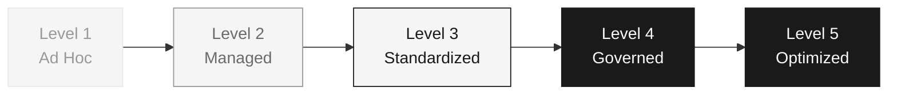

# Data Platform Maturity Model

## Executive Summary

- Five maturity levels -- ad hoc, managed, standardized, governed, optimized -- describe where an enterprise data platform actually is, not where a vendor pitch deck says it should be
- Six dimensions assessed at each level: data ingestion, governance, data products, platform operations, cost management, and AI/ML readiness
- Leaders use this to say "we are here, we need to get there" -- with concrete evidence for each claim
- Each level has observable characteristics, not vague aspirations. If you cannot point to specific artifacts and behaviors, you are not at that level.
- Jumping levels rarely works. The path through each level builds foundations for the next. Skipping Level 3 to reach Level 4 produces a fragile platform with governance theater instead of governance practice.

## The Five Levels

### Level 1 -- Ad Hoc

The organization has data, but no platform. Teams solve data problems independently, creating redundant effort and inconsistent results.

**Data ingestion.** Manual extracts, CSV uploads, ad-hoc scripts. Someone runs a query on a source system, dumps the output, and emails it to the analyst who requested it. When that person leaves, the process leaves with them.

**Governance.** None. No catalog, no ownership, no quality rules. Nobody knows what data exists, who owns it, or whether it is correct. Definitions vary by team and by spreadsheet.

**Data products.** None. Every team queries source systems directly. Analysts write their own SQL against production databases, sometimes degrading operational performance. The concept of a reusable dataset does not exist.

**Platform operations.** No shared infrastructure. Shadow IT data stores proliferate -- departmental databases, team-owned S3 buckets, shared drives full of Excel files. Nothing is monitored because there is nothing centralized to monitor.

**Cost management.** No visibility. Data infrastructure costs are hidden in project budgets, cloud accounts owned by individual teams, and software licenses nobody tracks. Finance cannot answer "how much do we spend on data?"

**AI/ML readiness.** None. Data scientists spend 80% of their time finding and cleaning data. Every project starts from scratch. No feature reuse, no shared datasets, no reproducibility.

### Level 2 -- Managed

A central data team exists and operates shared infrastructure. The platform is reactive -- it works, but it depends on individuals rather than processes.

**Data ingestion.** Scheduled pipelines exist -- cron jobs, Airflow DAGs, or equivalent. Basic change data capture (CDC) is in place for critical source systems. Ingestion still breaks when source schemas change, and recovery is manual.

**Governance.** Basic cataloging. Some documentation exists, usually maintained by the data team rather than data owners. No enforcement -- governance is advisory, not automated. People know they should document things but rarely do.

**Data products.** A central data warehouse exists. Shared tables are available, but there are no contracts, no SLAs, and no guarantees about freshness or quality. Consumers use the warehouse but have no way to know if a dataset is trustworthy without asking the data team.

**Platform operations.** Centralized warehouse with one team managing it. That team is a bottleneck. All requests flow through them -- new tables, new pipelines, access grants, schema changes. The backlog grows faster than the team can deliver.

**Cost management.** Reactive tracking. Monthly cloud bills are reviewed but not governed. Someone notices costs spiked and investigates after the fact. No cost allocation to teams or use cases. Optimization is opportunistic, not systematic.

**AI/ML readiness.** Data scientists can access the warehouse. They pull data into notebooks and build features independently. No feature reuse across projects. Two teams building churn models will independently engineer the same features differently.

### Level 3 -- Standardized

The platform has structure. Layers, standards, and monitoring exist. The gap is enforcement -- standards are documented but compliance is inconsistent.

**Data ingestion.** Bronze/silver/gold layers (or equivalent medallion architecture) are implemented. CDC and batch ingestion follow standardized patterns. Adding a new source system still requires the platform team, but the process is repeatable.

**Governance.** Data quality checks run at each layer transition. Ownership is defined per domain -- someone's name is attached to every dataset. Quality rules exist and fire alerts, but remediation is still manual and inconsistent. Lineage is partially documented.

**Data products.** Curated datasets exist in the gold layer. Business users can find and use them. But there are no formal contracts -- the platform team can change a schema without warning, and consumers discover breakage after it happens.

**Platform operations.** Infrastructure as code. Monitoring dashboards exist. Alert routing sends the right failures to the right people. Deployments follow a process, even if parts of that process are manual. The platform is stable but not self-service.

**Cost management.** Proactive cost governance. Query cost limits are in place. Storage tiering moves cold data to cheaper tiers. The team reviews costs weekly, not monthly. Individual expensive queries are identified and optimized.

**AI/ML readiness.** Training datasets are available in the gold layer. Feature engineering happens in notebooks, but at least the input data is clean and governed. Some teams share feature definitions informally. No feature store.

### Level 4 -- Governed

The platform is self-service with guardrails. Domain teams operate independently within boundaries defined by the platform team. Governance is automated, not aspirational.

**Data ingestion.** Fully automated. Schema evolution is handled programmatically -- additive changes flow through, breaking changes trigger review workflows. Domain teams can onboard new sources through self-serve tooling without filing a ticket.

**Governance.** Automated lineage from source to consumption. Data contracts are enforced -- producers cannot publish datasets that violate their contract, and consumers are notified before breaking changes land. Column-level security is in place. PII is tagged and access-controlled automatically.

**Data products.** Formal data products with published schemas, SLAs, quality contracts, and documentation. Products have owners, versioning, and deprecation policies. Consumers depend on the contract, not on the implementation.

**Platform operations.** Self-serve platform. Domain teams publish data products independently. The platform team builds and maintains the platform -- it does not build pipelines for other teams. Infrastructure is templated. New domains onboard in days, not months.

**Cost management.** FinOps is an active practice. Chargeback model allocates costs to consuming teams. Cost per data product is tracked and reported. Teams make informed tradeoffs between performance and cost because they see the bill.

**AI/ML readiness.** Offline feature store is operational. Shared features are computed once and reused across models. Feature definitions are versioned and governed. Data scientists spend their time on model development, not on data preparation.

### Level 5 -- Optimized

The platform is a competitive advantage. It adapts to new requirements without architectural rework. Data flows to where it is needed, in the format and latency required, with full governance.

**Data ingestion.** Real-time and batch are unified. Streaming-first where the use case demands it, batch where it makes sense. New ingestion patterns do not require new architecture -- the platform supports them natively.

**Governance.** Automated compliance. Regulatory requirements (GDPR, BCBS 239, DORA, CCPA) are mapped directly to platform controls. Compliance is provable, not asserted. Audit responses are generated from platform metadata, not assembled manually.

**Data products.** Products feed AI/ML workloads at scale. A marketplace enables discovery across domains. Data products have usage metrics, consumer feedback loops, and quality trend dashboards. The platform knows which products are valuable and which are unused.

**Platform operations.** Multi-cloud capable where business requirements demand it. Zero-touch deployments. The platform team focuses on capability evolution, not on keeping the lights on. Incident response is automated for known failure modes.

**Cost management.** Cost-optimized workload placement. Predictive cost modeling forecasts spend before workloads deploy. The platform automatically recommends cheaper execution strategies. Cost efficiency is a platform feature, not a manual exercise.

**AI/ML readiness.** Online feature store serves features at inference time with low latency. Production ML serving is integrated with the data platform. Feedback loops from model predictions flow back into the EDP, closing the data lifecycle. The platform supports the full ML lifecycle from training data to production monitoring.

## Maturity Assessment Table

Print this. Use it in steering committees. Circle where you actually are -- not where you want to be.

| Dimension | Level 1 -- Ad Hoc | Level 2 -- Managed | Level 3 -- Standardized | Level 4 -- Governed | Level 5 -- Optimized |
|---|---|---|---|---|---|
| **Data Ingestion** | Manual extracts, scripts, CSV uploads | Scheduled pipelines, basic CDC | Medallion layers, standardized patterns | Self-serve ingestion, automated schema evolution | Unified real-time and batch, streaming-first |
| **Governance** | None -- no catalog, no ownership | Basic catalog, no enforcement | Quality checks per layer, ownership defined | Automated lineage, enforced contracts, column security | Automated compliance, regulatory mapping to controls |
| **Data Products** | None -- direct source queries | Central warehouse, no contracts | Curated datasets, no formal SLAs | Formal products with schemas, SLAs, contracts | Marketplace, AI/ML integration, usage analytics |
| **Platform Ops** | Shadow IT, no shared infra | Centralized, one team bottleneck | IaC, monitoring, alert routing | Self-serve, domain teams publish independently | Multi-cloud, zero-touch deployment |
| **Cost Management** | No visibility, costs hidden | Reactive monthly tracking | Proactive governance, query limits, tiering | FinOps practice, chargeback, cost per product | Predictive modeling, automated optimization |
| **AI/ML Readiness** | None -- manual data prep every time | Warehouse access, no feature reuse | Training data available, notebooks only | Offline feature store, shared features | Online feature store, production serving, feedback loops |

## Common Mistakes

### Trying to jump from Level 1 to Level 4

Every organization wants to skip to self-serve data products and automated governance. Nobody wants to do the unglamorous work of Level 2 (build reliable pipelines) and Level 3 (standardize patterns and define ownership). But Level 4 governance automation only works when there are standards to automate. You cannot enforce contracts that do not exist. You cannot automate lineage for pipelines that have no structure.

The honest path: accept that moving one level takes 6-12 months of sustained effort. Plan for it. Fund it. Do not promise the board Level 4 outcomes on a Level 1 foundation.

### Confusing tooling maturity with organizational maturity

Buying Databricks does not make you Level 3. Deploying a data catalog does not give you governance. Standing up Airflow does not mean your ingestion is managed. Tools are necessary but nowhere near sufficient. Maturity lives in the practices, the ownership, the enforcement, and the culture -- not in the license agreement.

The test is simple: if you removed the tool tomorrow, would the practices survive? If the answer is no, the tool is compensating for organizational immaturity, not reflecting organizational capability.

### Measuring maturity by platform features instead of outcomes delivered

A platform with every feature enabled but no consumers is not mature -- it is expensive. Maturity is measured by what the platform delivers to the business, not by what it is capable of delivering in theory. Ten well-governed data products consumed by 50 teams is more mature than a feature-complete platform nobody trusts enough to use.

Count data products with active consumers. Measure time-to-insight for business questions. Track how many teams can ship analytics without filing a platform ticket. These are maturity indicators. Feature checklists are not.
