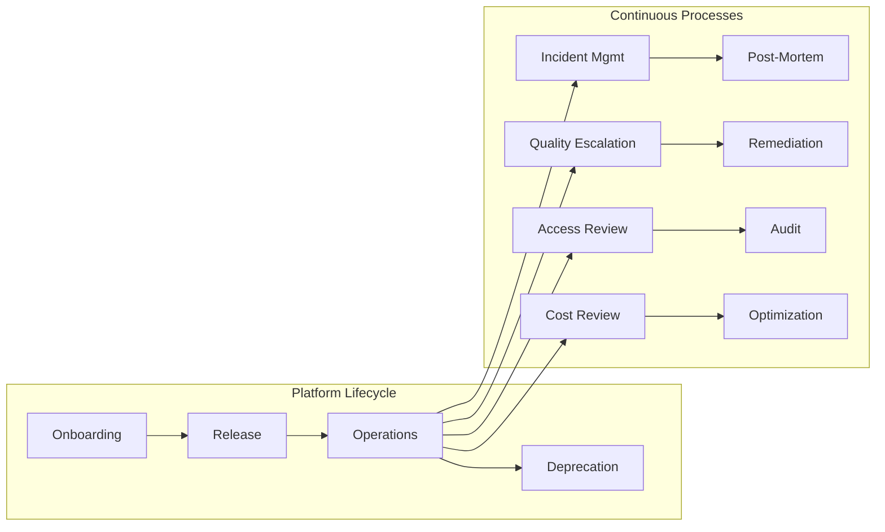

# Operating the Enterprise Data Platform

A technically decent platform fails when there is no ownership, weak support model, no platform SLOs, unclear incident handling, poor cost governance, no release process, and unclear stewardship escalation. This page defines how the EDP is run.

## Executive Summary

- The EDP is a product, not a project. It has owners, consumers, SLAs, a release process, and a cost model. If any of these are missing, the platform is a liability.
- Seven defined roles cover the full scope: strategy, engineering, data products, stewardship, governance, security, and support. Gaps in any role surface as unresolved incidents, ungoverned data, or uncontrolled costs.
- Eight operational processes -- from onboarding to deprecation -- define how work flows through the platform. Each process has a trigger, an owner, and a documented output.
- Fourteen KPIs across reliability, quality, cost, adoption, governance, and support prove whether the platform is well-operated or just well-built.
- A tiered support model ensures consumers get help at the right level, with response and resolution SLAs that are measurable and enforceable.

## Roles

Ambiguous ownership is the root cause of most platform failures. These roles are non-negotiable. Each one has a defined scope. When two roles overlap, the accountable party is explicit.

| Role | Responsibility | Owns |
|---|---|---|
| Platform Owner | Strategic direction, roadmap, stakeholder alignment | Platform vision, funding, priorities |
| Data Platform Engineering Lead | Technical architecture, infrastructure, tooling | Platform reliability, performance, cost |
| Data Product Owner | Individual data product lifecycle | Schema, quality, SLA, consumer relationships |
| Data Steward | Data quality, metadata, business definitions | Domain data accuracy, completeness, documentation |
| Governance Lead | Policy framework, compliance mapping, audit readiness | Access policies, retention rules, regulatory evidence |
| Security/Control Lead | Access control, masking, encryption, audit logging | Platform security posture, control attestations |
| Support/Operations Lead | Incident handling, consumer support, SLA tracking | Platform uptime, issue resolution, support SLAs |

**Platform Owner** sets direction. This person is accountable for the platform's existence and funding. They negotiate with stakeholders, prioritize the roadmap, and make trade-offs when competing demands hit. Without this role, the platform drifts toward whatever the loudest team needs.

**Data Platform Engineering Lead** builds and runs the platform. Infrastructure, pipelines, tooling, CI/CD, monitoring -- all of it. They own reliability and performance. When the platform is slow, broken, or expensive, this is the first call.

**Data Product Owner** owns a specific data product end-to-end. Schema design, quality thresholds, SLA definitions, and consumer communication. They are the single point of contact for anyone consuming their data product. A platform without data product owners has data but no products.

**Data Steward** operates at the domain level. They define business terms, validate data accuracy, maintain metadata, and escalate quality issues. Stewards are the bridge between business meaning and technical implementation. Without them, the catalog is a graveyard of undocumented tables.

**Governance Lead** owns the policy framework. They map regulatory requirements to platform controls, maintain compliance evidence, and run audit preparation. In regulated industries, this role is the difference between a clean audit and a finding.

**Security/Control Lead** manages access control, data masking, encryption at rest and in transit, and audit logging. They validate that the right people have the right access and that the evidence trail is intact. This role does not just set policy -- they verify enforcement.

**Support/Operations Lead** runs consumer support and incident management. They triage issues, track SLAs, coordinate resolution across teams, and run post-mortems. Without this role, every incident is ad hoc and every consumer is on their own.

## Processes

Each process has a trigger, an owner, and a defined output. Processes without these three elements are suggestions, not operations.

### Onboarding

**Trigger:** New data source registration or consumer access request.

**Process:** Assess source system characteristics (volume, frequency, schema stability). Define the data contract (schema, SLA, quality thresholds). Validate initial data quality against thresholds. Provision access with appropriate controls.

**Owner:** Platform engineering + data product owner.

**Output:** Documented source with ingestion pipeline running, data contract registered, consumer access provisioned.

A source without a contract is not onboarded. It is dumped.

### Release and Change Management

**Trigger:** New feature, pipeline change, infrastructure update, or configuration change.

**Process:** Pull request with peer review. CI/CD validation (tests, linting, contract checks). Staging deployment with validation. Production promotion with rollback plan documented.

**Owner:** Platform engineering.

**Output:** Deployed change with verified rollback plan and change record.

No change reaches production without review. No exceptions. "It's just a config change" is how production breaks.

### Incident Management

**Trigger:** Monitoring alert, consumer-reported issue, or quality threshold breach.

**Process:** Detect and classify by severity:

- **P1** -- Platform-wide outage, data loss, security breach. All hands.
- **P2** -- Multiple data products affected, SLA breach imminent. Immediate response.
- **P3** -- Single data product degraded, workaround available. Scheduled fix.
- **P4** -- Minor issue, cosmetic, no consumer impact. Backlog.

Route to the appropriate owner. Resolve. Run post-mortem for P1 and P2. Document root cause and preventive actions.

**Owner:** Support/operations lead.

**Output:** Resolved incident, RCA document (P1/P2), preventive actions tracked to completion.

### Schema Evolution Approval

**Trigger:** Data product owner requests a schema change (additive or breaking).

**Process:** Impact analysis -- which consumers depend on the affected fields? Consumer notification with change window. Contract validation to confirm backward compatibility or document breaking change. Approval from governance lead for breaking changes.

**Owner:** Data product owner + governance lead.

**Output:** Approved schema change. Breaking changes include a deprecation window (minimum 30 days, 90 days for regulated products) and consumer migration support.

Additive changes (new columns, new optional fields) follow a lighter path. Breaking changes (column removal, type change, semantic change) require explicit consumer acknowledgment.

### Data Quality Escalation

**Trigger:** Quality threshold breach detected by monitoring.

**Process:** Alert fires. Investigate root cause. Classify the source of the issue:

- **Source issue** -- upstream system sent bad data. Escalate to source owner.
- **Platform issue** -- ingestion or infrastructure failure. Platform engineering fixes.
- **Transformation issue** -- logic error in pipeline. Data product owner fixes.

Remediate. Document root cause and update monitoring if the threshold needs adjustment.

**Owner:** Data steward + platform engineering.

**Output:** Quality restored to within thresholds, root cause documented, monitoring updated.

### Access Approval

**Trigger:** New access request from a user or service account.

**Process:** Validate the requester's role and business justification. Apply minimum-necessary principle -- grant only what is needed. Route through approval workflow (manager + data owner). Provision access. Log the grant with timestamp, approver, and justification.

**Owner:** Security/control lead.

**Output:** Access granted with full audit trail. Periodic access reviews (quarterly minimum) to revoke stale grants.

### Cost Review

**Trigger:** Monthly review cycle or cost threshold alert.

**Process:** Review cost by workload, domain, and data product. Identify anomalies (sudden spikes, unused resources, runaway queries). Allocate costs via chargeback model to consuming domains. Recommend optimization actions (query tuning, storage tiering, compute right-sizing).

**Owner:** Platform owner + engineering lead.

**Output:** Monthly cost report, optimization actions with owners, chargeback updates distributed to domain leads.

Cost visibility without accountability changes nothing. Chargeback creates accountability.

### Deprecation

**Trigger:** Data product or pipeline reaches end-of-life.

**Process:** Notify all consumers with a 90-day deprecation window. Provide migration path to replacement product or alternative. Support consumer migration during the window. Decommission the asset after the window closes. Archive metadata and lineage for audit.

**Owner:** Data product owner.

**Output:** Deprecated asset removed from production, all consumers migrated, metadata archived.

Deprecation without a migration path is abandonment. Every deprecation notice must include the alternative.

## Measures

KPIs that are not tracked are aspirations. KPIs that are tracked but not acted on are theater. These are the metrics that prove the platform is well-operated.

| Category | Metric | Target |
|---|---|---|
| Reliability | Pipeline success rate | > 99.5% |
| Reliability | Data freshness SLA compliance | > 99% of products within SLA |
| Reliability | Mean time to recovery (MTTR) | < 2 hours for P1/P2 |
| Quality | Quality incident rate | < 2 per month per domain |
| Quality | Data product completeness | > 99.5% for governed products |
| Cost | Cost per data product | Tracked and trending down |
| Cost | Platform cost growth vs data volume growth | Cost growth < volume growth |
| Adoption | Active data product consumers | Growing quarter over quarter |
| Adoption | Self-service query adoption | > 50% of analytical consumers |
| Governance | Policy compliance rate | > 95% of assets compliant |
| Governance | Audit evidence generation time | < 1 day for any regulatory request |
| Support | Consumer onboarding time | < 5 business days |
| Support | Issue resolution within SLA | > 90% |

**How to read these targets:** The numbers are starting points, not universal truths. Adjust based on your platform maturity and regulatory environment. But track all of them from day one. A platform that cannot report its own pipeline success rate has no business claiming reliability.

## Support Tiers

Consumer support is not "Slack the platform team and hope someone answers." It is a structured model with defined scope and SLAs at each tier.

| Tier | What It Covers | Response SLA | Resolution SLA |
|---|---|---|---|
| Self-service | Documentation, data catalog, known issues, FAQs | Immediate (docs available 24/7) | N/A |
| Tier 1 | Access issues, query help, basic troubleshooting | 4 hours | 1 business day |
| Tier 2 | Data quality issues, pipeline failures, SLA breaches | 2 hours | 4 hours |
| Tier 3 | Platform incidents, infrastructure failures, security events | 30 minutes | 2 hours |

**Self-service** is the first line. If a consumer's question is answered in the documentation or data catalog, they should find it there. Investing in self-service reduces Tier 1 volume and frees the support team for real problems.

**Tier 1** handles day-to-day consumer issues. "I cannot access this dataset." "This query is slow." "Where do I find customer churn data?" These are high-volume, low-complexity requests.

**Tier 2** is where data quality and pipeline reliability issues land. A consumer reports stale data. A quality check fires. A pipeline fails and an SLA is at risk. These require investigation and coordination across teams.

**Tier 3** is reserved for platform-level incidents. Infrastructure failure, security event, data loss, or multi-product outage. These trigger the incident management process and require immediate response from platform engineering.

## Why This Matters for Regulated Industries

In regulated environments, operational discipline is not optional. Regulators do not audit your architecture diagrams. They audit your operational evidence.

**Reproducibility.** Every pipeline run must be reproducible. Given the same inputs and the same code version, the output must be identical. This requires versioned code, versioned configurations, immutable infrastructure, and deterministic transformations. If you cannot reproduce a pipeline run from six months ago, you cannot defend the numbers it produced.

**Controlled change.** No unreviewed changes reach production. Every change has a pull request, a reviewer, a CI/CD check, and a deployment record. This is not bureaucracy -- it is the evidence trail that regulators expect. "Who approved this change?" must have a clear, auditable answer.

**Traceable lineage.** Lineage must be automated, not manually maintained. Manual lineage documentation drifts from reality within weeks. Automated lineage -- extracted from pipeline definitions, query logs, and transformation metadata -- stays current because it is derived from the system itself.

**Recoverability.** Disaster recovery must be tested, not just documented. RTO (recovery time objective) and RPO (recovery point objective) must be defined for every data product, documented, and validated through regular DR drills. "We have backups" is not a DR plan.

**Access evidence.** Who accessed what data, when, and why -- exportable for audit on demand. Access logs must be immutable, centralized, and queryable. When a regulator asks "who accessed PII in the last 90 days," the answer must be available within hours, not weeks.

**Environment separation.** Development, staging, and production environments must be distinct, with promotion gates between them. No direct writes to production. No shared credentials across environments. No "just testing something in prod." Promotion gates enforce the change management process and create the audit trail regulators require.
