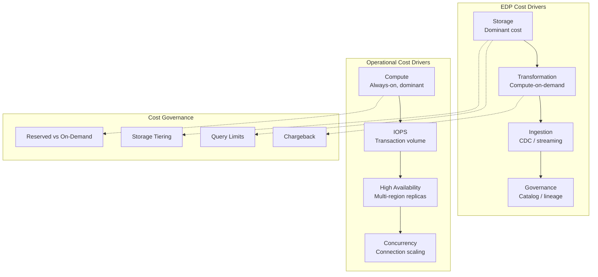

# Cost Architecture for Data Platforms

## Executive Summary

- Enterprise data platforms and operational platforms have fundamentally different cost profiles. Managing them with a single cost model guarantees you will overspend on one, underfund the other, or both.
- Understanding cost drivers prevents the "we can't afford our own platform" conversation. The real question is whether you can afford the alternative.
- FinOps for data is not the same as FinOps for compute -- storage dominates EDP costs, compute dominates operational costs. Applying compute-centric optimization to an EDP misses the point.
- Cost governance must be designed into the platform, not bolted on after the bill arrives. Retrofitting cost controls into a platform that was built without them is 10x harder than building them in from the start.
- The most expensive platform is one that tries to do everything. A platform that runs both analytical and operational workloads poorly costs more than two platforms that each do their job well.

## Cost Profile Comparison

| Cost Driver | Enterprise Data Platform | Operational Platform |
|-------------|--------------------------|---------------------|
| **Dominant cost** | Storage (60-80% of spend) | Compute (60-80% of spend) |
| **Scaling model** | Storage scales linearly with data volume; compute scales with query demand | Compute scales with concurrent users and transaction volume |
| **Billing model** | Query-based (bytes scanned, slot-hours, DBUs) | Connection-based (instance hours, vCPUs, IOPS) |
| **Idle cost** | Low -- storage is cheap, compute shuts down | High -- instances must stay warm for SLA compliance |
| **Burst cost** | Significant -- ad-hoc queries and backfills can spike compute | Moderate -- auto-scaling handles peaks, but provisioned capacity sets a floor |
| **Data transfer** | High on multi-cloud or cross-region analytics | Lower per-transaction, but adds up at high transaction volume |
| **Cost predictability** | Variable -- depends on query patterns and data growth | More predictable -- driven by provisioned capacity |
| **Primary optimization lever** | Storage tiering + query efficiency | Right-sizing instances + reserved capacity |
| **Cost per unit of work** | Cost per query or cost per TB scanned | Cost per transaction or cost per API call |
| **Waste pattern** | Unused datasets retained indefinitely | Over-provisioned instances running at 15% utilization |

## EDP Cost Drivers

### Storage

Storage is the baseline cost that grows with data volume and retention policy. In most EDPs, storage accounts for the majority of the bill -- not because storage is expensive per unit, but because data accumulates.

The primary lever is tiering. Hot storage (frequently queried, SSD-backed) costs 5-10x more than cold storage (rarely accessed, archival). A platform without tiering policies pays hot-storage prices for data that nobody has queried in six months.

Practical controls:

- Implement lifecycle policies that auto-move data from hot to warm after 90 days, warm to cold after 12 months
- Partition data by date so cold partitions can be tiered without moving entire tables
- Track storage growth per dataset and per domain -- not just total platform storage
- Delete or archive data that has no regulatory retention requirement and no active consumers

### Compute

EDP compute is on-demand query processing. Cost scales with query complexity (bytes scanned, shuffles, joins) rather than data volume. A well-partitioned table with 100 TB can be cheaper to query than a poorly structured 1 TB table.

The trap is ad-hoc queries. A single analyst running `SELECT *` across an unpartitioned multi-TB table can consume more compute in one query than all scheduled pipelines run in a day.

Practical controls:

- Enforce query cost limits (BigQuery custom cost controls, Databricks SQL warehouse auto-stop)
- Require partition filters on large tables -- reject queries that scan entire datasets without filters
- Separate scheduled workloads from ad-hoc workloads with different compute pools
- Monitor cost per query and surface the top-10 most expensive queries weekly

### Ingestion

CDC and streaming ingestion have their own cost model, distinct from storage and query compute. Dataflow workers, Kafka Connect clusters, Event Hubs throughput units, and Fivetran row counts all contribute.

Ingestion cost scales with change volume, not total data volume. A table with 10 billion rows that changes 1,000 rows per day is cheap to ingest. A table with 1 million rows that churns 500,000 rows per day is expensive.

Practical controls:

- Right-size CDC capture frequency -- not everything needs minute-level freshness
- Use batch extraction for slowly changing sources instead of paying for CDC infrastructure
- Monitor throughput unit utilization and scale down during off-peak hours
- Negotiate connector pricing based on actual row volumes, not provisioned capacity

### Transformation

dbt models, Spark jobs, and data quality checks consume compute during processing. Batch transformations are predictable -- they run on a schedule with known data volumes. Ad-hoc and development workloads are not.

The hidden cost is re-processing. A transformation that fails and must be re-run from scratch doubles the compute bill. Incremental models that process only new data cost a fraction of full-refresh models.

Practical controls:

- Default to incremental processing for all models where source data supports it
- Use smaller compute clusters for development and testing workloads
- Schedule heavy transformations during off-peak hours when on-demand pricing is lower
- Track compute cost per dbt model or Spark job -- identify which transformations dominate spend

### Governance Overhead

Data catalogs, lineage tracking, quality checks, and access policy enforcement are not free. Each adds processing cost, storage for metadata, and compute for scans and checks.

This cost is justified when it prevents downstream failures, regulatory fines, or duplicated effort. It is not justified when governance becomes a checkbox exercise that adds overhead without producing actionable outcomes.

Practical controls:

- Run data quality checks only on datasets that have active consumers
- Tier lineage tracking depth by data product criticality -- not everything needs column-level lineage
- Avoid cataloging every intermediate table -- catalog data products, not implementation details

## Operational Platform Cost Drivers

### Compute

Always-on instances are the dominant cost for operational platforms. Databases, API servers, caches, and message brokers must be running 24/7 to meet availability SLAs. You pay for provisioned capacity whether it is used or not.

The waste pattern is over-provisioning. Teams size instances for peak load and leave them running at 15-20% average utilization. The gap between provisioned and actual usage is pure waste.

Practical controls:

- Right-size instances quarterly based on actual utilization metrics, not projected peak
- Use auto-scaling where the workload allows it -- not all databases support horizontal auto-scaling, but many compute layers do
- Separate production from non-production -- dev and staging do not need the same instance sizes
- Shut down non-production environments outside business hours

### IOPS

Transaction volume drives cost more than storage volume in operational systems. A database with 100 GB of data processing 50,000 transactions per second costs far more than a 10 TB database with 100 queries per hour.

IOPS pricing varies dramatically across cloud providers and storage tiers. Provisioned IOPS on AWS RDS can double the storage bill. Azure Cosmos DB charges per RU (request unit). These costs are often invisible until the first bill arrives.

Practical controls:

- Benchmark actual IOPS requirements before selecting storage tier
- Use read replicas to offload reporting queries from the primary instance
- Implement connection pooling to reduce per-connection overhead
- Cache frequently accessed data to reduce database round-trips

### High Availability

Multi-region deployments, failover replicas, and disaster recovery infrastructure multiply the base cost by 2-3x. Each replica requires its own compute, storage, and network bandwidth.

Not every operational system needs multi-region HA. The cost of downtime for a customer-facing payment system justifies multi-region. The cost of downtime for an internal case management tool probably does not.

Practical controls:

- Classify operational systems by criticality tier and apply HA only where business impact justifies the cost
- Use active-passive failover instead of active-active multi-region where recovery time objectives allow it
- Test failover regularly -- paying for DR infrastructure you have never tested is paying for a false sense of security

### Concurrency

Connection pooling, auto-scaling for peak load, and load balancing infrastructure add cost that scales with the number of concurrent users and requests, not with data volume.

The cost trap is provisioning for peak concurrency at all times. If peak load occurs during a 2-hour window each day, paying for peak capacity 24/7 wastes 90% of the spend.

Practical controls:

- Implement connection pooling (PgBouncer, ProxySQL) to reduce per-connection resource consumption
- Use auto-scaling with appropriate cool-down periods -- scaling up fast, scaling down gradually
- Queue non-urgent requests during peak periods instead of scaling to meet every concurrent demand
- Monitor connection counts and identify connection-leaking applications

## Cost Governance Patterns

### Query Cost Limits

Uncapped query access is the fastest way to blow a monthly budget. A single `SELECT *` across a 50 TB unpartitioned table in BigQuery scans 50 TB and costs roughly $250 at on-demand pricing. Multiply by a team of analysts exploring data, and the bill becomes material.

Implementation options:

- **BigQuery:** Custom cost controls per user or project. Slot reservations cap compute spend regardless of query volume.
- **Databricks:** SQL warehouse sizing with auto-stop. Cluster policies that limit maximum node count.
- **Snowflake:** Resource monitors with suspend triggers. Warehouse auto-suspend and auto-resume.
- **Redshift:** WLM queues with concurrency scaling limits.

### Storage Tiering Policies

Automate data lifecycle management. Data that has not been queried in 90 days should not sit on hot storage. Data that has not been queried in a year should be in archive tier or deleted.

Implementation:

- Tag datasets with last-access timestamps
- Apply lifecycle rules at the storage layer (GCS lifecycle policies, S3 Intelligent-Tiering, ADLS access tier management)
- Review tiering effectiveness monthly -- if most data is in hot tier, the policies are not working

### Chargeback Models

Allocate platform costs to consuming teams or domains. Without chargeback, the platform team absorbs all costs and has no mechanism to influence consumption behavior. With chargeback, teams that consume more pay more, creating natural pressure to optimize.

Three models, in order of increasing maturity:

1. **Showback:** Report costs per team without actual billing. Creates awareness without organizational friction.
2. **Proportional allocation:** Split total platform cost by consumption metrics (queries run, storage used, data ingested). Simple but can feel arbitrary.
3. **Direct chargeback:** Each team pays for their actual resource consumption via internal billing. Most effective but requires accurate metering and organizational buy-in.

### Cost per Data Product

Track the total cost of ownership for each data product: ingestion, transformation, storage, governance, and serving. This makes cost a first-class attribute of the data product alongside quality, freshness, and documentation.

A data product that costs $50,000/month to maintain but is consumed by one team running weekly reports is a candidate for optimization or retirement. A data product that costs $5,000/month and serves 15 downstream consumers is a good investment.

### Reserved Capacity vs On-Demand

Reserved capacity (1-year or 3-year commitments) offers 30-60% discounts over on-demand pricing. The tradeoff is flexibility -- you pay whether you use it or not.

The rule of thumb: reserve baseline capacity, use on-demand for burst. If your minimum daily compute consumption is predictable, reserve that floor. If your peak is 3x the baseline for 2 hours per day, use on-demand for the burst.

## Anti-Patterns

### "We can't afford two platforms"

Running everything on one platform costs more when it fails at half the workloads. An EDP forced to serve operational traffic needs always-on compute (expensive for analytical platforms), low-latency query paths (not what they are optimized for), and operational SLAs (which require over-provisioning). The "savings" from consolidation vanish when you pay for the wrong architecture running the wrong workloads.

Two right-sized platforms cost less than one over-provisioned platform that does both jobs poorly.

### "Unlimited query access"

No cost governance means the monthly budget is whatever your users happen to spend. One analyst discovering an unpartitioned table can generate more compute cost in an afternoon than all scheduled pipelines produce in a week.

Query cost limits are not about restricting access. They are about making cost visible and creating feedback loops. When users see "this query will scan 12 TB and cost $60," behavior changes naturally.

### "We'll optimize later"

Cost patterns are architectural decisions. The storage layout, partitioning strategy, compute model, and data retention policy are set during platform design. Retrofitting cost optimization into a platform that stores everything in hot tier, uses full-refresh transformations, and has no partition strategy requires re-engineering the platform -- not tuning a configuration.

Build cost awareness into the architecture from day one. It is not an optimization. It is a design constraint.

### "Same infrastructure for dev and prod"

Development workloads running on production-grade infrastructure waste money. Dev does not need multi-region HA, production-tier IOPS, or enterprise-grade SLAs. A dev environment should be as small as possible while still being representative of production behavior.

Practical impact: a production Databricks cluster with 8 nodes running 24/7 costs roughly $15,000/month. A dev cluster with 2 nodes that auto-terminates after 30 minutes of inactivity costs under $500/month. Running dev on the production cluster because "it's easier" burns $14,500/month for convenience.

## Cost Decision Framework

### When to Use On-Demand vs Reserved

| Signal | On-Demand | Reserved |
|--------|-----------|----------|
| Workload is new and usage patterns are unknown | Yes | No |
| Baseline consumption is stable and predictable | No | Yes |
| Peak-to-baseline ratio exceeds 3x | Peak portion | Baseline portion |
| Commitment period aligns with platform roadmap | N/A | Yes -- only commit if the platform will exist for the commitment term |
| Cloud provider offers flexible reservations (convertible RIs, savings plans) | Less critical | Preferred over rigid reservations |

Start on-demand. Measure for 3 months. Reserve the stable baseline. Keep burst capacity on-demand.

### When to Invest in a Separate Serving Layer

The serving layer question is really a cost question disguised as an architecture question. Querying the EDP directly for operational use cases costs more than most teams expect.

Invest in a serving layer when:

- **Query frequency is high.** More than 1,000 queries per day against the same dataset -- the cumulative EDP query cost exceeds the fixed cost of a serving layer (Redis, PostgreSQL, API cache).
- **Query pattern is predictable.** Point lookups, filtered results, paginated lists -- these patterns are 10-100x cheaper on a purpose-built serving layer than on an analytical query engine.
- **Latency requirements are strict.** Sub-second response times on an EDP require over-provisioned compute. A serving layer delivers sub-second responses at a fraction of the cost.
- **Consumer count is growing.** Each new consumer of EDP data adds query cost. A serving layer absorbs new consumers with minimal marginal cost.

The serving layer often pays for itself within 2-3 months by replacing expensive EDP queries with cheap lookups against materialized data.

### When Multi-Cloud Is Cost-Justified

Multi-cloud adds organizational overhead: duplicate skills, duplicate tooling, duplicate governance, and cross-cloud data transfer costs. It is rarely justified by cost alone.

Multi-cloud is cost-justified when:

- **Regulatory requirements mandate data residency** in regions where your primary cloud has limited presence
- **Workload-specific pricing** makes a second cloud meaningfully cheaper for a specific use case (e.g., GPU compute for ML training is materially cheaper on one provider)
- **Negotiation leverage** from credible multi-cloud capability produces discounts that exceed the operational overhead
- **Acquisition integration** brings a second cloud that would cost more to migrate than to maintain

Multi-cloud is not cost-justified when:

- The motivation is "avoiding vendor lock-in" without a concrete cost comparison
- The workloads are small enough that switching costs are trivial
- The organization lacks the engineering depth to operate two cloud environments well
- Cross-cloud data transfer costs exceed the savings on compute or storage

The honest test: calculate the fully loaded cost of operating in two clouds (engineering time, training, tooling, data transfer, governance duplication) and compare it to the savings. In most cases, the overhead exceeds the savings by a wide margin.
