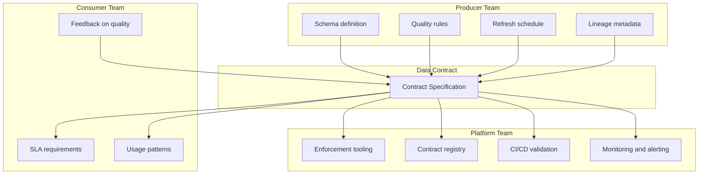

# Data Contracts

## Executive Summary

- Data contracts are the interface layer between data producers and consumers. They define what a data product delivers, how it behaves, and what guarantees it makes.
- A contract specifies schema, quality expectations, SLAs, ownership, and evolution rules -- everything a consumer needs to build against a data product without knowing the producer's internals.
- Without contracts, every downstream consumer is coupled to the producer's internal implementation. One column rename, one type change, one shifted schedule -- and things break silently.
- Contracts are the mechanism that makes EDP and operational platform coexistence work. They formalize the handoff points described in [EDP vs Operational](../position/edp-vs-operational.md).
- They are not optional. They are the difference between "we have data products" and "we have shared tables that break."

## What a Data Contract Contains

A data contract is a structured, machine-readable specification. It covers six areas.

### Schema Definition

The exact shape of the data being delivered:

- Column names and data types
- Nullability constraints
- Column descriptions (business meaning, not just technical names)
- Primary key and uniqueness declarations
- Nested structure definitions for complex types

### Quality Expectations

What "good data" means for this product:

- **Freshness SLA** -- maximum acceptable age of the most recent record
- **Completeness** -- minimum percentage of non-null values for critical columns
- **Uniqueness** -- columns or column combinations that must be unique
- **Value constraints** -- valid ranges, allowed enum values, referential integrity checks
- **Volume expectations** -- expected row count ranges per refresh (catches silent upstream failures)

### Ownership

Who is accountable when something goes wrong:

- Producing team name and org unit
- Primary contact (team channel, not an individual)
- Escalation path for SLA breaches
- On-call rotation reference (if applicable)

### SLA

The operational guarantees the producer commits to:

- Refresh frequency (hourly, daily, event-driven)
- Maximum staleness window
- Availability target (e.g., 99.5% for analytical products, 99.9% for serving endpoints)
- Latency bounds for query/serving endpoints

### Evolution Rules

How the contract changes over time:

- Additive changes (new columns) are safe and do not require consumer coordination
- Breaking changes (type modifications, column removals, semantic shifts) require a deprecation window
- Minimum deprecation notice period (e.g., 30 days)
- Communication channel for change announcements
- Versioning strategy (v1 remains available during v2 migration)

### Lineage Metadata

Where the data comes from:

- Source systems feeding this data product
- Transformation logic summary (not the full DAG -- a human-readable description)
- Refresh dependency chain (what must complete before this product refreshes)
- Data classification and sensitivity labels

## Contract Example

A concrete contract for a customer analytics data product:

```yaml
contract:
  name: customer_360
  version: "2.1"
  status: active
  domain: customer

schema:
  format: delta
  location: gold.customer.customer_360
  columns:
    - name: customer_id
      type: string
      nullable: false
      description: "Global customer identifier, sourced from MDM"
      primary_key: true
    - name: full_name
      type: string
      nullable: false
      description: "Customer legal name"
    - name: email
      type: string
      nullable: true
      description: "Primary email address"
    - name: segment
      type: string
      nullable: false
      description: "Customer segment classification"
      allowed_values: [premium, standard, basic]
    - name: lifetime_value
      type: decimal(18,2)
      nullable: true
      description: "Calculated lifetime value in USD"
    - name: first_transaction_date
      type: date
      nullable: true
      description: "Date of earliest recorded transaction"
    - name: last_activity_date
      type: date
      nullable: false
      description: "Most recent interaction across all channels"
    - name: is_active
      type: boolean
      nullable: false
      description: "True if activity within last 90 days"
    - name: updated_at
      type: timestamp
      nullable: false
      description: "Row-level last modified timestamp"

quality:
  freshness:
    max_staleness: 6h
    check_column: updated_at
  completeness:
    email: 0.85
    lifetime_value: 0.90
    segment: 1.0
  uniqueness:
    - [customer_id]
  volume:
    min_rows: 500000
    max_rows: 15000000

ownership:
  team: customer-data-engineering
  contact: "#customer-data-eng"
  escalation: "#data-platform-oncall"
  org_unit: Customer Analytics

sla:
  refresh_frequency: every 4 hours
  availability: 99.5%
  max_query_latency: 30s

evolution:
  strategy: semantic_versioning
  breaking_change_notice: 30 days
  deprecation_window: 90 days
  changelog_channel: "#data-contracts-changes"

lineage:
  sources:
    - crm.salesforce.contacts
    - payments.stripe.transactions
    - web.analytics.sessions
    - mdm.customer_master
  transformation_summary: >
    Joins customer master with transaction history,
    web session activity, and CRM contact records.
    Calculates lifetime value, determines activity status,
    and applies segmentation rules.
  classification: pii
  refresh_dependencies:
    - silver.customer.contacts_cleaned
    - silver.payments.transactions_validated
```

## Who Owns What

The contract is a boundary object. Three teams interact with it, but they own different pieces.



**Producer team** writes the contract and is accountable for meeting it. They define the schema, set quality thresholds, commit to refresh schedules, and document lineage.

**Platform team** builds the infrastructure that enforces contracts. They run the contract registry, wire up CI/CD validation, and operate the monitoring that detects breaches. They do not write the contracts -- they make contracts enforceable.

**Consumer team** declares their requirements and consumes against the contract, not against the underlying implementation. They raise issues when the contract does not meet their needs. They do not reach past the contract to query raw tables.

## Contract Enforcement Patterns

A contract that exists only in a YAML file is a suggestion. Enforcement is what makes it a contract.

### Schema Validation on Write

Validate incoming data against the contract schema before it lands in the consumption layer. If the data does not conform -- wrong types, unexpected nulls, missing required columns -- reject it. The producer's pipeline fails, not the consumer's dashboard.

### Quality Gates in Pipeline

Quality checks run as pipeline steps after data lands but before consumers can access it. If freshness, completeness, uniqueness, or volume thresholds breach, the pipeline fails and the previous good version remains active. Consumers see stale-but-correct data rather than fresh-but-broken data.

### Contract CI/CD

Schema changes are validated before they merge. The CI pipeline diffs the proposed contract against the current version, flags breaking changes, and blocks the merge if breaking changes lack a deprecation plan. This is the same principle as API versioning -- you do not ship a breaking API change without a migration path.

### Consumer Notification

When a contract changes -- even non-breaking changes -- consumers get notified automatically. New columns, updated descriptions, adjusted quality thresholds. This is not a courtesy. It is how consumers stay aware of what they are building against.

## Evolution and Breaking Changes

Data contracts must evolve. The question is not whether they change, but how they change without breaking downstream systems.

### Safe Changes (Non-Breaking)

- **Adding columns** -- existing consumers ignore columns they do not use
- **Relaxing nullability** -- a column that was required becoming optional does not break consumers
- **Widening types** -- int32 to int64, for example (consumer code handles the wider type)
- **Adding new allowed values** -- expanding an enum set

### Breaking Changes

- **Removing columns** -- consumers referencing deleted columns break immediately
- **Changing types** -- string to integer, decimal precision changes, timestamp format changes
- **Tightening nullability** -- a previously optional column becoming required can break producers
- **Renaming columns** -- semantically identical, technically a drop-and-add
- **Changing semantic meaning** -- same column name, different business definition (the worst kind)

### Versioning Strategy

Use semantic versioning for data products:

- **v1** and **v2** coexist during migration. Consumers are given a deprecation window (minimum 30 days, typically 90) to migrate.
- The producer maintains both versions until the deprecation window closes.
- After the window, the old version is removed. Any consumer who did not migrate breaks -- and that is on them. The deprecation window is the contract.

## Anti-Patterns

### The Contract Nobody Reads

**What it looks like:** Contracts exist in a Confluence page or a docs folder. They were written during project kickoff and never updated. No pipeline validates them. No alert fires when they are violated. They are technically correct and practically useless.

**Why it fails:** A contract that is not enforced in the pipeline is documentation, not a contract. Documentation drifts from reality. Within six months, the contract says one thing and the data does another.

**Fix:** Contracts must be machine-readable and enforced in CI/CD and pipeline execution. If the contract is not checked on every run, it does not exist.

### The Contract That Blocks Everything

**What it looks like:** Contracts are so strict that any change -- adding a column, adjusting a threshold, updating a description -- requires a formal review process with multiple approvals. Teams stop evolving their data products because the overhead is not worth it.

**Why it fails:** Overly rigid governance creates shadow systems. Producers route around the contract by publishing "unofficial" datasets that are not governed at all. You end up with less governance, not more.

**Fix:** Separate additive changes (auto-approved, notify consumers) from breaking changes (require review and deprecation plan). Most contract changes should be frictionless.

### The Verbal Contract

**What it looks like:** The producer and consumer teams had a meeting. They agreed on schema, refresh timing, and quality expectations. Everyone nodded. Nobody wrote it down. Six months later, people rotate off the team and the agreement evaporates.

**Why it fails:** Verbal agreements do not survive team changes, reorgs, or the passage of time. When something breaks, there is no reference point for what was actually promised.

**Fix:** If it is not in the contract spec, it was not agreed. Every agreement about data delivery gets codified in the contract YAML and enforced in the pipeline. No exceptions.
