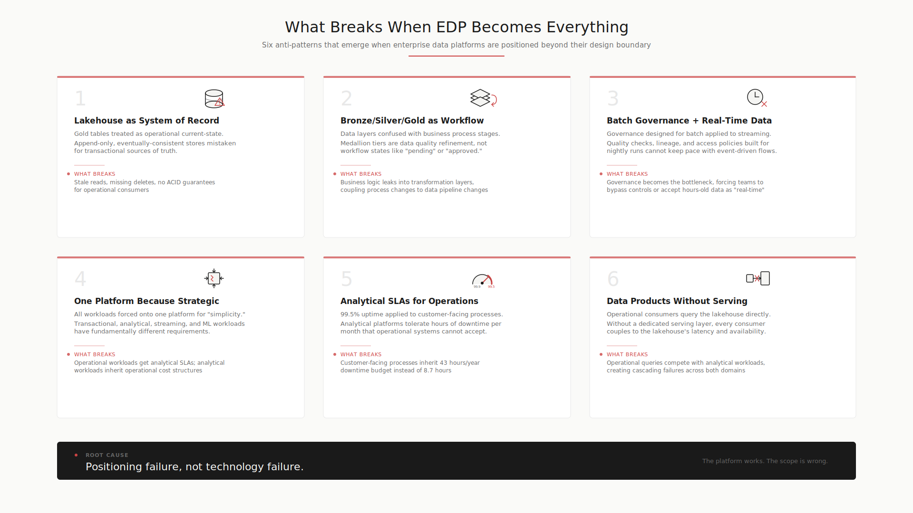

# What Breaks When EDP Becomes Everything

## Executive Summary

- Six architectural anti-patterns that emerge when enterprises overload their data platform with operational responsibilities
- Each pattern follows the same structure: what it looks like, why teams do it, what breaks, what to do instead
- These are not theoretical risks. They are patterns observed repeatedly in enterprise data programs.
- Recognizing these patterns early saves millions in rework and years of architectural debt.
- The root cause is almost always positioning, not technology.

<figure markdown="span">
  { width="100%" }
  <figcaption>Six architectural anti-patterns -- root cause is positioning, not technology</figcaption>
</figure>

## Anti-Pattern 1: The Lakehouse as System of Record

**What it looks like:** Business teams treat lakehouse tables (Delta, Iceberg) as the authoritative current-state record for operational processes. Case workers query the gold layer to find the "current" status of an application or transaction.

**Why teams do it:** The lakehouse has governed, integrated data that no single source system provides. It feels like the "best" version of the truth. Operational teams want to consume from one place.

**What breaks:**

- Batch latency means the "current" record is stale by minutes to hours
- No ACID transaction guarantees for concurrent updates
- Schema evolution in the lakehouse can break downstream operational consumers without warning
- No rollback mechanism for operational mistakes
- SLA mismatch: analytical platform uptime is not operational platform uptime

**What to do instead:** The lakehouse is the historical, integrated truth. Operational current-state belongs in a purpose-built operational data store or serving layer with transactional guarantees, point-in-time consistency, and operational SLAs.

---

## Anti-Pattern 2: Bronze/Silver/Gold as Operational Workflow

**What it looks like:** Teams map business process stages to data layers. "Bronze is raw intake, silver is validation, gold is approved." They build workflow logic into the transformation pipeline.

**Why teams do it:** The layer names sound like process stages. The progression from raw to refined mirrors a business approval flow. It is an intuitive but incorrect mapping.

**What breaks:**

- dbt/Spark jobs run on batch schedules, not on business events
- No concept of "this record needs human review" in a transformation pipeline
- Error handling in batch pipelines is retry/reprocess, not "route to exception queue"
- Business process state requires mutation. Bronze/silver/gold is append-mostly.
- You cannot send an email, trigger a notification, or assign a task from a dbt model

**What to do instead:** Business process workflows belong in a workflow engine (Temporal, Airflow for orchestration, or purpose-built BPM). The EDP ingests the outputs of those workflows for historization and analytics.

---

## Anti-Pattern 3: Batch Governance Meets Real-Time Commands

**What it looks like:** The data platform team builds real-time streaming pipelines on top of the EDP, expecting the governance layer (catalog, lineage, access controls) to work at streaming speed.

**Why teams do it:** Leadership wants "real-time analytics" and the EDP is the governed platform. Combining them seems efficient.

**What breaks:**

- Data cataloging and lineage tracking add latency incompatible with real-time processing
- Access control policies designed for batch queries do not map to streaming event authorization
- Schema registries and data contracts operate differently in streaming vs batch
- The monitoring and alerting model is fundamentally different (throughput/lag vs query performance)

**What to do instead:** Separate the streaming/event processing layer from the analytical governance layer. Events flow through a stream processing platform (Kafka, Flink) into the EDP for governed analytics. Real-time operational decisions happen in the streaming layer with their own lightweight governance.

---

## Anti-Pattern 4: One Platform Because "Strategic"

**What it looks like:** Architecture review boards mandate that all data workloads run on the "strategic platform" to avoid proliferation. The EDP absorbs operational workloads, serving workloads, and everything in between.

**Why teams do it:** Platform consolidation reduces vendor management overhead. "One platform" sounds cleaner to leadership. Funding models reward platform teams for adoption volume.

**What breaks:**

- The platform optimizes for nothing because it tries to serve everything
- Operational SLAs force the platform team into 24/7 support for workloads they did not design for
- Cost model becomes unpredictable because analytical and operational workloads have different cost profiles
- Platform team becomes a bottleneck for every data need in the enterprise
- Innovation slows because every change must consider every consumer type

**What to do instead:** Define explicit platform boundaries. The EDP owns analytical, historical, and governance workloads. Operational workloads get their own platform with their own SLAs, cost model, and team. The two platforms connect through well-defined integration patterns (events, APIs, data contracts).

---

## Anti-Pattern 5: Analytical SLAs for Operational Workloads

**What it looks like:** The EDP has a 99.5% availability SLA with planned maintenance windows. Operational teams build customer-facing processes that depend on EDP uptime. During a maintenance window, the customer-facing process goes down.

**Why teams do it:** The data is in the EDP. It seems faster to query it directly than to build a separate serving layer.

**What breaks:**

- Planned downtime for analytical workloads becomes unplanned downtime for operations
- Query performance varies by analytical load -- an expensive report can slow operational queries
- Scaling for analytical throughput is different from scaling for operational concurrency
- Incident priority conflicts: is the analytical pipeline failure or the operational outage more urgent?

**What to do instead:** Operational workloads need their own serving infrastructure with operational-grade SLAs (99.9%+). Data flows from EDP to serving layer, not from EDP directly to operations. The serving layer is designed for low-latency, high-concurrency, always-on access.

---

## Anti-Pattern 6: Data Products Without a Serving Layer

**What it looks like:** The data team publishes "data products" as curated datasets in the lakehouse. Operational teams are told to consume these data products directly for their applications.

**Why teams do it:** Data products are the new hotness. They are governed, documented, and discoverable. It feels natural to expose them to operational consumers.

**What breaks:**

- Data products in a lakehouse are optimized for analytical consumption (large scans, aggregations)
- Operational consumers need point lookups, filtered results, low-latency responses
- Lakehouse query engines are not designed for thousands of concurrent small queries
- Data product refresh cadence (hourly, daily) does not match operational freshness requirements
- API consumers cannot query Spark SQL or Trino directly

**What to do instead:** Data products are the source of truth for governed datasets. A serving layer (APIs, caches, materialized views, feature stores) sits between data products and operational consumers. The serving layer is optimized for the access patterns operations need.

---

## The Pattern Behind the Patterns

Every anti-pattern here follows the same root cause:

1. The EDP has the best data (integrated, governed, historized)
2. Someone with an operational need discovers this
3. They build against the EDP because the data is there
4. They inherit the wrong SLAs, latency, and mutation model
5. The platform team scrambles to support workloads they did not design for
6. The platform degrades for everyone

The fix is not technical. It is positional. Define what the EDP is. Define what it is not. Enforce the boundary. Provide alternatives for operational needs.
