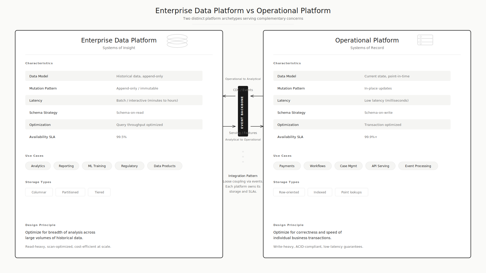
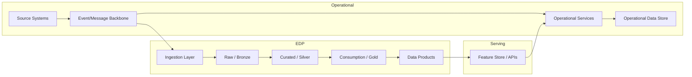

# EDP vs Operational Platform

## Executive Summary

- Enterprise data platforms and operational platforms solve fundamentally different problems and operate under different constraints
- Confusing them leads to wrong SLAs, wrong funding models, and platforms that fail at both jobs
- This page provides a side-by-side comparison across 12 dimensions so architects and leaders can draw a clear line
- Neither platform is "better" -- they coexist. The question is which workload belongs where.
- If you are building one platform to rule them all, you are building zero platforms that work.

<figure markdown="span">
  { width="100%" }
  <figcaption>Enterprise data platform (systems of insight) vs operational platform (systems of record)</figcaption>
</figure>

## The Comparison

| Dimension | Enterprise Data Platform | Operational Platform |
|-----------|------------------------|---------------------|
| **Purpose** | Integrate, historize, analyze, govern data across domains | Execute business processes, manage live state, serve transactions |
| **Latency expectation** | Minutes to hours (batch), seconds for interactive queries | Milliseconds to low seconds |
| **Workload type** | Analytical queries, aggregations, ML training, reporting | OLTP transactions, event processing, workflow execution |
| **Source of truth** | Integrated historical truth across domains | Current operational state for a specific domain |
| **Data mutation** | Append-mostly, immutable history, SCD patterns | In-place updates, deletes, ACID transactions |
| **SLA/SLO** | Query performance, data freshness, completeness | Uptime, response time, transaction throughput |
| **Consumers** | Analysts, data scientists, BI tools, regulatory teams | Applications, APIs, workflow engines, end users |
| **Storage pattern** | Columnar, partitioned, tiered (hot/warm/cold) | Row-oriented, indexed, optimized for point lookups |
| **Governance style** | Centralized cataloging, lineage, access policies, data quality | Application-level validation, API contracts |
| **Failure tolerance** | Retry, reprocess, backfill -- no data loss but delay acceptable | Must not lose a transaction, failover required |
| **Cost model** | Storage-heavy, compute-on-demand, query-based billing | Compute-heavy, always-on, connection-based |
| **Scaling pattern** | Scale storage and compute independently, elastic | Scale for concurrent connections and transaction throughput |

## Use Case Examples

### Belongs on EDP

- Customer 360 analytics across all product lines
- Regulatory reporting (BCBS 239, DORA)
- Executive management information dashboards
- ML model training on historical transaction data
- Data quality monitoring across domains
- Self-service analytics for business users
- Historical trend analysis for pricing or risk

### Belongs on Operational Platform

- Payment processing and settlement
- Case management workflow
- Real-time fraud scoring during transaction
- Inventory management and order fulfillment
- API serving for customer-facing applications
- Event-driven process orchestration
- Session state management

### Shared / Integration Layer

- Customer master data (MDM as source, EDP as historical consumer)
- Feature serving (EDP computes features, serving layer delivers at low latency)
- Reporting APIs (EDP produces data, API layer serves it)
- Event backbone (connects operational events to EDP ingestion)

## The Data Flow Between Them

## Common Mistakes

These are explored in depth in [What Breaks When EDP Becomes Everything](anti-patterns.md):

- Treating gold-layer tables as operational systems of record
- Running workflow orchestration on the analytical platform
- Expecting analytical SLAs for operational workloads
- Forcing all data needs into one platform because "strategic"
