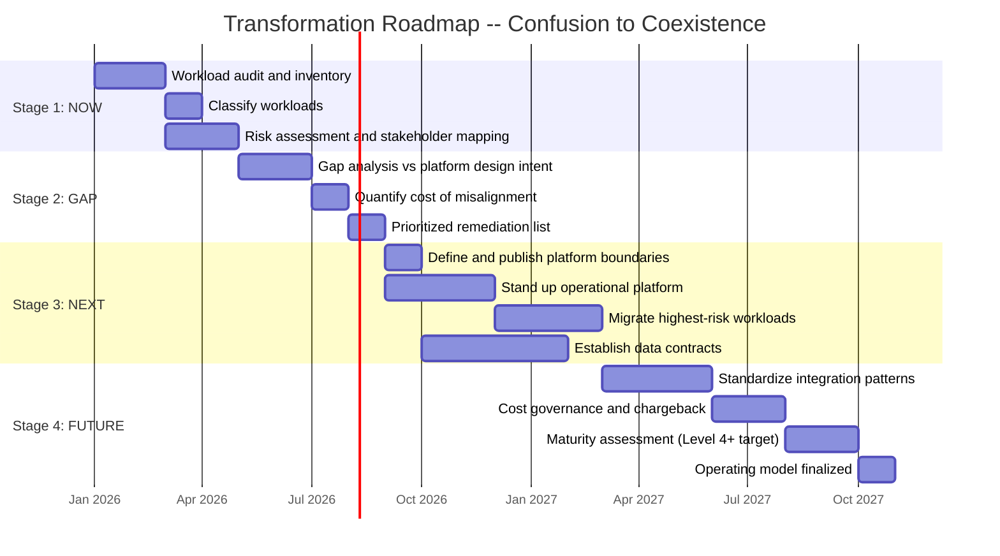

# Transformation Roadmap: From Confusion to Coexistence

## Executive Summary

- Most enterprises are not starting from zero. They have an existing data platform with misaligned expectations, overloaded scope, and stakeholders who believe the platform should do everything.
- The roadmap is four stages: understand the current state, identify the gaps, introduce boundaries, mature the architecture.
- This is not a technology migration plan. It is a positioning and architecture evolution plan. No vendor will solve this for you.
- The hardest part is not building new platforms. It is convincing stakeholders that the existing platform's scope needs to change.
- Each stage is independently valuable. You do not need to complete all four to see improvement.

## Stage 1: NOW -- Understand Current State

This is where most enterprises are. The platform exists, workloads are running, and nobody has a clear inventory of what is actually happening on it.

### What You Do

**Audit every workload on the EDP.** Not a sample. Not the top ten. All of them. If you do not know what is running, you cannot make decisions about what should stay and what should move.

**Classify each workload.** Use the [Decision Tree](../decisions/decision-tree.md) to sort every workload into one of four categories:

| Classification | Definition | Example |
|---|---|---|
| **Analytical** | Historical queries, aggregations, cross-domain joins. This is what the EDP was built for. | Customer 360, regulatory reporting, executive dashboards |
| **Operational** | Real-time state management, transactional processing, sub-second SLA. Does not belong on the EDP. | Payment processing, case management, live inventory |
| **Hybrid** | Spans both platforms. The workload has analytical and operational components that must be separated explicitly. | Feature serving (EDP computes, serving layer delivers), near-real-time dashboards |
| **Misplaced** | Workload on the EDP that clearly belongs elsewhere but ended up here because the data was available. | API serving for mobile apps hitting gold-layer tables directly |

**Identify which workloads are causing platform stress.** Look for SLA mismatches, cost spikes, and performance issues. The workload that brought the cluster down last quarter is probably misplaced.

**Document stakeholder expectations vs platform design.** This is the gap that matters most. When stakeholders expect sub-second response from an analytical engine, the problem is not the engine. It is the expectation.

### Practical Steps

**Interview the platform team.** Ask one question: "What keeps you up at night?" The answer will point directly to the misplaced workloads. Platform engineers know which workloads do not belong -- they just have not been given permission to say no.

**Review incident history.** Pull the last 12 months of platform incidents. Categorize each one: was the root cause a genuinely analytical workload failing, or was it a misplaced workload consuming resources it was never designed to consume? In most enterprises, 60-80% of platform incidents trace back to workloads that do not belong there.

**Map consumers.** For every workload, answer three questions: who queries it, for what purpose, and at what frequency? A gold-layer table queried once a day for a dashboard is healthy. The same table hit 10,000 times per second by a customer-facing API is a fire.

### Stage 1 Deliverables

- **Workload inventory spreadsheet** -- classify each workload as analytical, operational, hybrid, or misplaced
- **Risk heat map** -- which misplaced workloads cause the most platform stress (compute contention, SLA breaches, incident frequency)
- **Stakeholder expectation document** -- what leadership thinks the platform does vs what it actually does

### Deliverable

A workload inventory with classification and risk assessment. One document. Every workload listed, classified, and scored by risk. This is the foundation for everything that follows.

---

## Stage 2: GAP -- Identify Misalignments

You now know what is running and where. This stage quantifies the cost of misalignment and prioritizes what to fix first.

### What You Do

**Compare workload classification to platform design intent.** Use the [Capability Map](../decisions/capability-map.md) as the reference. Every workload classified as "operational" or "misplaced" in Stage 1 is a gap. Every "hybrid" workload without explicit boundary definitions is a risk.

**Flag every operational workload running on the EDP.** These are the ones causing disproportionate pain. They consume compute designed for analytical throughput, they impose latency requirements the platform cannot meet, and they create SLA conflicts with legitimate analytical consumers.

**Quantify the cost of misalignment.** Put numbers on it:

- **SLA breaches.** How many times did the platform miss its SLA because a misplaced workload consumed resources? Track the downstream impact -- delayed reports, failed regulatory submissions, missed business decisions.
- **Performance degradation.** What is the query performance delta when misplaced workloads are active vs inactive? If your BI queries run 3x slower during API-serving peak hours, that is a quantifiable cost.
- **Support burden.** How much platform team time goes to supporting workloads that do not fit? Every hour spent tuning the EDP for operational workloads is an hour not spent improving analytical capabilities.
- **Infrastructure cost.** What does it cost to overprovision the EDP to handle workloads it was not designed for? Over-sizing compute clusters to absorb operational load is a direct, measurable expense.

**Decide which workloads need their own home.** Not every misplaced workload needs to move. Some are low-risk, low-volume, and tolerable on the EDP with minor isolation. Others are burning the platform down and need to move immediately. Prioritize by risk and cost, not by effort.

### Deliverable

A gap analysis with a prioritized remediation list. Each misplaced workload gets a severity score, a cost estimate, and a recommended destination. This becomes the business case for Stage 3.

---

## Stage 3: NEXT -- Introduce Boundaries

This is the hard stage. Stages 1 and 2 are analysis. Stage 3 is organizational change.

### What You Do

**Define what the EDP is and is not.** Use the positioning from [What EDP Is](../position/what-edp-is.md). Write it down. Publish it. Make it official. The EDP integrates, historizes, and governs data for analytics, AI, and regulatory reporting. It does not process transactions, serve APIs at millisecond latency, or manage operational workflow state.

**Publish the boundary.** Create an explicit list: these workloads belong on the EDP, these do not. Reference the [EDP vs Operational](../position/edp-vs-operational.md) comparison so stakeholders understand the reasoning, not just the ruling.

**Introduce the operational platform or serving layer.** Misplaced workloads need somewhere to go. Standing up the operational platform before migrating workloads is not premature -- it is a prerequisite. You cannot tell teams to move their workloads if there is nowhere to move them.

**Migrate the highest-risk misplaced workloads first.** Start with the workload that caused the most incidents in Stage 1. It has the clearest justification and the most visible impact. Early wins build credibility for subsequent migrations.

**Establish data contracts between EDP and operational consumers.** Every data flow that crosses the platform boundary gets a [data contract](../patterns/data-contracts.md). Schema, quality expectations, SLAs, ownership. No exceptions. The contract is how two platforms coexist without creating chaos at the boundary.

### The Hard Part

This stage requires organizational change, not just technology.

**The platform team must say "no."** This is the single most difficult cultural shift. Platform teams have been rewarded for adoption -- more workloads means more value, more funding, more headcount. Saying "this workload does not belong here" feels like rejecting work. It is not. It is protecting the platform's ability to serve its actual purpose. The platform team needs explicit leadership backing to enforce boundaries.

**Leadership must fund the operational platform separately.** If the operational platform is funded as a "data platform initiative," it will be deprioritized in favor of the existing EDP. It needs its own budget, its own team, and its own success criteria. Two platforms means two funding streams.

**Stakeholders must accept that "strategic platform" does not mean "only platform."** The EDP is strategic. It is also scoped. These are not contradictions. A strategic platform with clear boundaries serves the enterprise better than a strategic platform that tries to be everything and delivers nothing well.

### Owner Roles

- **Platform team** -- defines boundaries, provides self-serve tooling, enforces contracts
- **Domain teams** -- own data product schemas, quality, documentation
- **Architecture review board** -- approves new workload placement using the [Decision Tree](../decisions/decision-tree.md)
- **Leadership** -- funds operational platform separately, reframes "strategic platform" messaging

### Deliverable

Published platform boundaries and first migrations completed. The organization now has an explicit, documented answer to "where does this workload go?" and at least one successful migration proving the model works.

---

## Stage 4: FUTURE -- Governed Coexistence

Both platforms are live. The question is no longer "should we have two platforms?" -- it is "how do we run them well together?"

### What You Do

**Operate both platforms with clear boundaries and SLAs.** Each platform has its own SLAs tuned to its design goals. The EDP commits to data freshness, query performance, and completeness. The operational platform commits to uptime, transaction latency, and throughput. Neither platform's SLAs compromise the other's.

**Standardize integration patterns.** Every cross-platform data flow follows a known pattern. No ad-hoc integrations, no undocumented data copies, no shadow pipelines.

| Integration Pattern | Direction | Use Case |
|---|---|---|
| Change data capture (CDC) | Operational to EDP | Ingest operational state changes for historization |
| Events / streaming | Operational to EDP | Real-time event ingestion for analytics |
| Reverse ETL | EDP to operational | Push computed insights back to operational systems |
| Feature serving | EDP to serving layer | Serve ML features at inference time |
| API layer | Serving layer to consumers | Deliver EDP outputs at operational latency |

**Govern all cross-platform data flows with contracts.** Every integration pattern in the table above has a [data contract](../patterns/data-contracts.md) specifying schema, quality, freshness, and ownership. The contract is enforceable -- violations trigger alerts, not emails.

**Implement cost governance with chargeback models.** Each consuming team sees its cost. The EDP charges for compute and storage consumed. The operational platform charges for transactions and uptime. When teams see the bill, they make better decisions about where to place workloads. See [Cost Architecture](../patterns/cost-architecture.md) for implementation details.

**Assess maturity across all dimensions.** Use the [Maturity Model](../decisions/maturity-model.md) to measure progress. Governed coexistence means Level 4 or above across all six dimensions. If any dimension is below Level 4, that is the next investment priority.

### Deliverable

An operating model for the dual-platform architecture. This is not a document that sits in Confluence -- it is the working model that governs day-to-day platform operations, intake decisions, integration patterns, and cost allocation.

---

## Roadmap Visualization

The timeline is illustrative. Some enterprises will move through Stage 1 in weeks. Others will spend six months in Stage 3 because the organizational change is harder than the technology. The sequence matters more than the duration.

---

## Common Roadmap Failures

### "We will migrate everything at once"

Big-bang migrations fail. They fail in application modernization. They fail in cloud migration. They fail here too. The risk surface is too large, the blast radius is too wide, and the organizational capacity for change is always smaller than planners assume.

Migrate incrementally. Start with the workload that causes the most pain. Prove the model works. Build confidence. Then migrate the next one. Each successful migration makes the next one easier because the receiving platform matures and the organization builds muscle memory.

### "We do not need an operational platform, just better SLAs on the EDP"

You cannot SLA your way out of an architectural mismatch. Promising 99.99% uptime and sub-second latency on a platform designed for throughput and historical depth does not change the platform's design. It creates SLAs that the platform cannot meet, which erodes trust in SLAs generally.

The EDP's SLAs should reflect what the EDP actually does: data freshness within defined windows, query performance for analytical workloads, completeness and quality guarantees. Operational SLAs -- transaction latency, uptime, throughput -- belong on a platform built for those requirements.

### "Let us fix governance first"

Governance without boundaries is policy without enforcement. You can write all the data governance policies you want. If the platform boundary is undefined -- if operational workloads and analytical workloads are cohabiting on the same platform with the same SLAs -- governance policies have no mechanism of enforcement.

Boundaries first. Then governance. Governance is how you maintain boundaries over time. It is not a substitute for establishing them.

### "The vendor will solve this"

Vendors sell platforms, not organizational clarity. No vendor product will tell your stakeholders which workloads belong on the EDP and which do not. No vendor product will fund your operational platform. No vendor product will convince your VP of Engineering that "strategic" does not mean "only."

Vendors provide technology. The transformation described in this roadmap is primarily organizational. Buy the right tools, absolutely. But do not confuse purchasing a platform with executing a transformation. The hardest problems in this roadmap are people problems, and those are not on any vendor's feature list.
